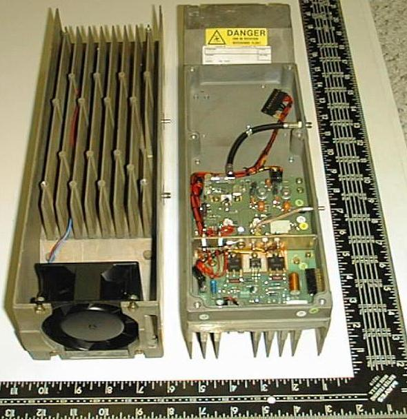
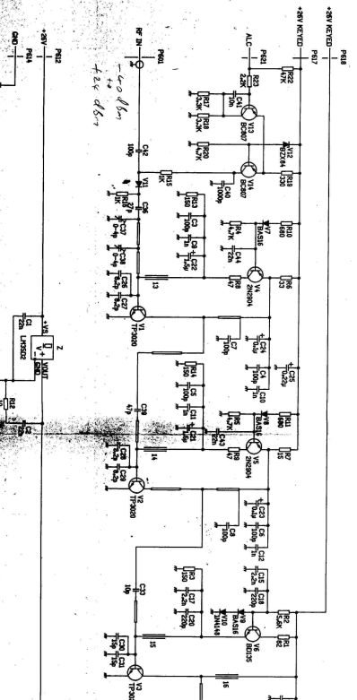
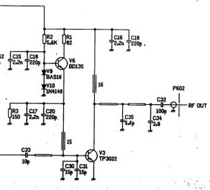
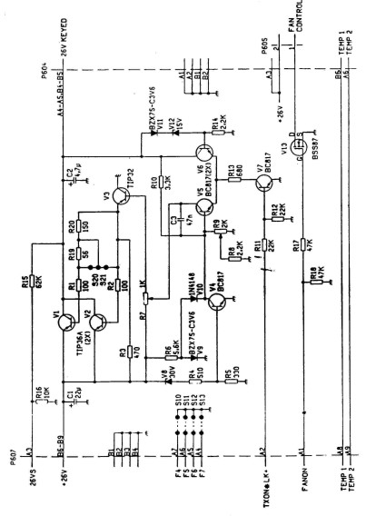

## Description
* Ericsson 900 MHz cellular amplifier, removed during site upgrade, working
* RF Transistors TP3022A (1), TP3020A (2)
* Control Transistors TIP36A (2), TIP32 (1)
* Length 14¾", Width 4½", Height 3¼"
* RF Shielded compartment 7/8th's inch deep, cover included
* Large die cast heat sink assembly with high volume PAPST/EBM fan 3 inch
* Ten Watts continuous output at its intended frequency of 860MHz. A couple of watts less on 903MHz.
* Power required is 24 to 28 volts regulated at 2.5A DC.
* Shipping Weight 8+ LB.
* This is a broadband class C (non-linear) amp intended for FM. It will also work effectively for CW, without modification. It should be possible to make the amp linear and it would then be usable for SSB.

## Drawings

Schematic of most of amplifier:  

Schematic of final stage of amplifier:  

Schematic of control circuit:  

## Opening it up

Place the unit on the table in front of you with the fan on the right hand side and the removable cover facing up. Remove the cover by loosening the 6 screws. When you remove the cover you will see a lot of empty space and a couple of circuit boards and a shielded cable. The circuit board on the left is the control board and the other circuit board is the amp. Try to refrain from running your fingers over the amp, even when the power is off - while it is quite stable, no need to generate a spark, or get body chemistry or drool onto this nicely made board.

## Modifications for Use in Amateur Radio

1. Carefully remove the control board then toss it into your junk box - there are some useful parts on it, but it is not needed for our application.
2. Carefully strip out the extra wiring harness, it is not needed.
3. The input and output can be left as standard SMA connectors. I find the SMA's a bit fragile for use on heavy coax as seen on a typical 900MHz antenna cable. You have 2 choices, make a short flexible adapter cable to adapt the output from SMA to whatever your coax is, or you can replace the output connector with an N type and that is a bit of a challenge. Unless you are experienced at building up cables for this frequency I suggest you take the easy way out.
4. Wire the fan to run continuously by connecting XXXX.
5. Make up a power supply cable, connecting XXXXXX.
6. Apply power and confirm that the amp is correctly wired.
7. Disconnect power and connect a dummy load or power meter plus antenna or load to the output.
8. Connect a 903.100MHz frequency source to the input.
9. Connect power and turn on, monitoring for the destruction of test equipment or signal source.
10. While monitoring power output of the amp, tweak XX for maximum power. You should get 7 watts or more.
11. That's it. You now have a working amp. Close it up. Your work on this part is done.

For more information please send an email to [Rick (VE3CVG)](mailto:ve3cvg@rac.ca).
