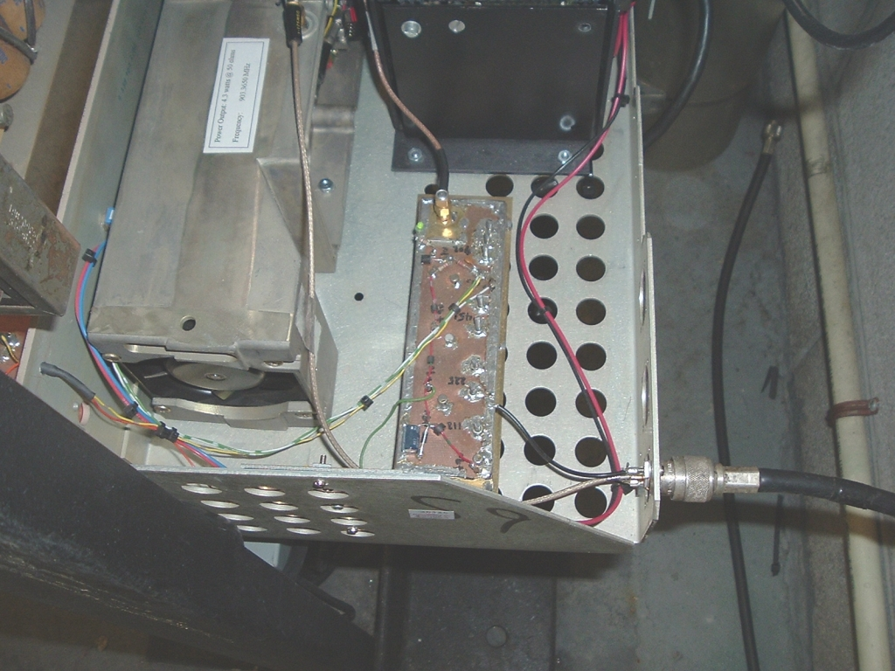

The CW signal of the WCARC beacon can be heard on 903.367MHz. If you are close, you will hear the steady tone of the oscillator under the main signal, because the PA is keyed, not the oscillator.

## Near view of the Beacon

  
Picture by Phil VE3CIQ

## Beacon in the Bay - view 1

  
Picture by Phil VE3CIQ

## Beacon in the Bay - view 2

  
Picture by Phil VE3CIQ

## Beacon Antenna

  
Picture by Phil VE3CIQ

## View from the roof #1

  
Picture by Phil VE3CIQ

## View from the roof #2

  
Picture by Phil VE3CIQ

## Signal as seen by Tom VA3NFA

  
Picture by Tom VA3NFA
