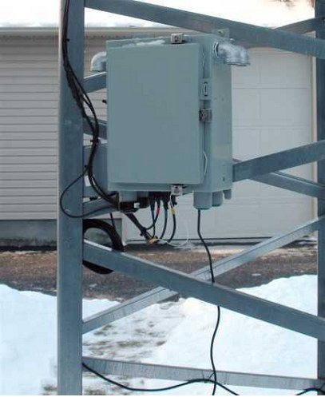
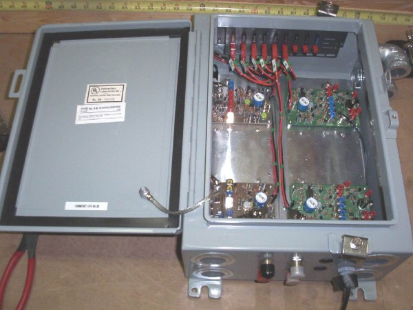
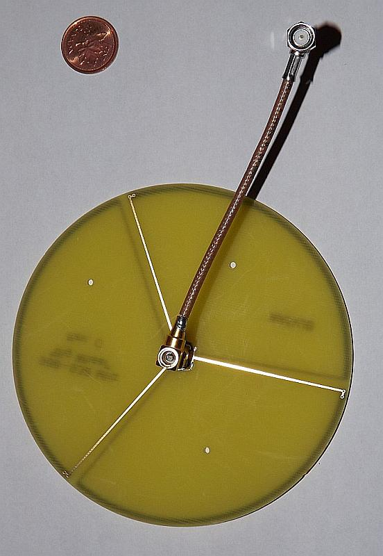
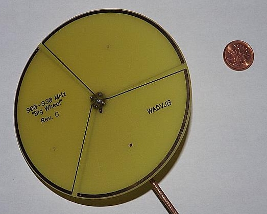
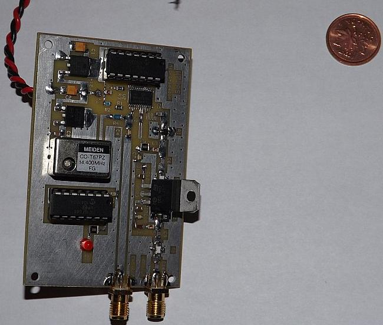
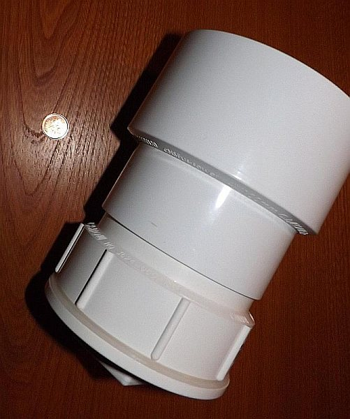
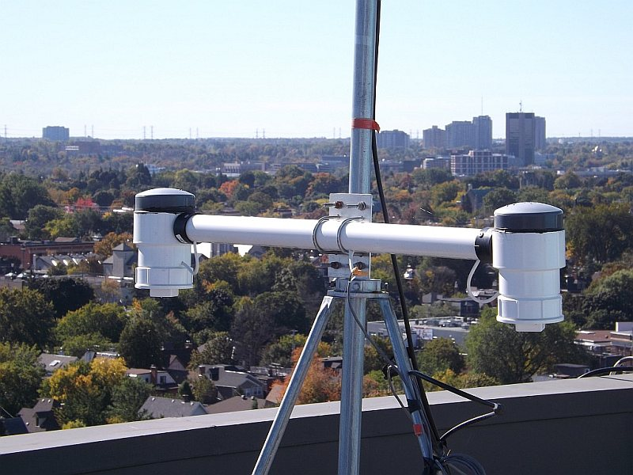

The WCARC operates several beacons which are useful for testing equipment, aiming antennas, and propagation analysis.
In the first half of 2008, Doug VE3XK has assembled the lower 4 beacons into a common package, with a common keyer and
power supply. Similarly the antennas for these beacons are mounted on a single common mast. The beacons were activated
in their permanent configuration on December 5, 2008. The antennas should launch most of the power at an
elevation angle of 20-30 degrees above the horizon.

The beacons were relocated from FN15wg to FN15vf in July 2009.  
The beacons were relocated from FN15vf to FN25ce in May 2015.  
The beacons were relocated from FN25ce to FN25bg in June-July 2015.

Following is a list of the WCARC beacons:

### 6m - VE3WCC - 50.009MHz CW
* status: fully operational
* located in FN25bg
* power is 3w
* KU4AB Horizontal Omnidirectional Antenna (approx 5 dBi Gain) at about 25 ft AGL

### 2m - VE3WCC - 144.297MHz CW
* status: fully operational
* located in FN25bg
* power is 3w
* KU4AB Horizontal Omnidirectional Antenna (approx 5 dBi Gain) at about 25 ft AGL

### 1.25m - VE3WCC - 222.063MHz CW
* status: fully operational
* located in FN25bg
* power is 3w
* KU4AB Horizontal Omnidirectional Antenna (approx 5 dBi Gain) at about 25 ft AGL

### 70cm VE3WCC - 432.358MHz CW
* status: fully operational
* located in FN25bg
* power is 3w
* KU4AB Horizontal Omnidirectional Antenna (approx 5 dBi Gain) at about 25 ft AGL

### 33cm - VE3WCC - 903.360MHz CW
* status: fully operational
* beacon module purchased from Bruce (W7BAS)
* located in FN25dj
* power is 100mw
* antenna is a horizontal omni (big wheel by WA5VJB)
* elevation is about 180 ft AGL

### 23cm - VE3WCC - 1296.060MHz CW
* status: fully operational
* beacon module purchased from Bruce (W7BAS)
* located in FN25dj
* power is 100mw
* antenna is a horizontal omni (big wheel by WA5VJB)
* elevation is about 180 ft AGL

## Photos

### 2m, 1,25m, 70cm and 33cm Beacons

### 903MHz and 1296MHz Beacons

## Other Beacons

| Band  | Call   | Grid   | Pwr  | ASL (feet) | Freq (MHz) |
|:-----:|--------|--------|:----:|:----------:|:----------:|
| 6m    | VE2RCS | FN25   | 5W   | TBD        | 50.033     |
| 6m    | VE3DDW | EN93vu | 5W   | TBD        | 50.073     |
| 2m    | VE2FUT | FN25up | 15W  | 1000       | 144.280    |
| 2m    | VE3DDW | EN93vu | 5W   | TBD        | 144.273    |
| 2m    | VE3ZAP | EN94vc | 15W  | 1500       | 144.280    |
| 2m    | W2RTB  | FN12ar | 3W   | 450        | 144.276    |
| 2m    | WA1ZMS | FM07fm | 100W | 4200       | 144.285    |
| 2m    | WA2UMX | FN23xc | 10W  | 1000       | 144.289    |
| 1.25m | VE2FUT | FN25up | TBD  | 1000       | 222.059    |
| 1.25m | WA2UMX | FN23xc | 10W  | 1000       | 222.048    |
| 1.25m | W2RTB  | FN12ar | 3W   | 450        | 222.057    |
| 70cm  | VE2FUT | FN25up | TBD  | 1000       | 432.270    |
| 33cm  | WA1ZMS | FM07fm | 100W | 4200       | 903.055    |
| 23cm  | VE2FUT | FN25up | TBD  | 1000       | 1296.326   |
