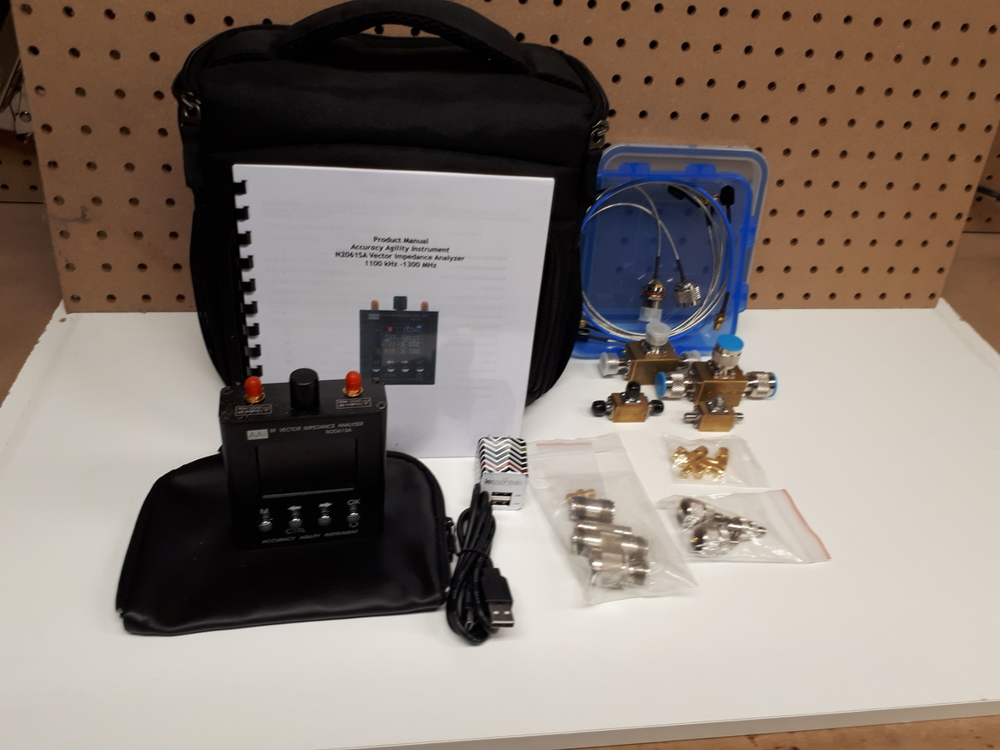

The N2061SA Vector Impedance Analyzer is mainly used for testing antenna, RF component and circuit board impedance.  With built-in lithium ion battery, the unit is small enough to fit in a pocket and convenient for outdoor applications. A clear colour screen with simple pushbuttons makes it easy to use. (A simplified operating procedure is mounted on the rear side). It includes coverage of the HF, VHF and UHF amateur radio bands up to 1300 Mhz.

### Main Features

* Wide frequency range – S11 port: 1.11 to 1300 MHz; S21 port: 1.11 to 600 MHz
* Small size – 84 x 116 x 32 mm; Light weight – 240 grams
* Built-in 2000 mAh lithium polymer battery with working time of more than 4 hours
* High resolution (four significant figures) single point measurements

### Specifications

* S11 port working frequencies: 1.11 to 1300 MHz
* S21 port working frequencies: 1.11 to 600 MHz
* Frequency step size: 1 kHz
* Display: 2.4 inch (~61 mm) TFT  320 x 240 pixels (QVGA)
* Battery Capacity: 2000 mAh (7.4 Watt Hours). Current consumption ~750mA.
* Charging Current: 400 mA. Use external phone charger of >1A – not phone itself.
* Charging: via USB port (no Data Transfer).
* Automatic Shut-Down: optional, settable from 5 to 60 minutes of control inaction
* Measurement Parameters:  Resistance, Reactance, VSWR, S11, S21
* Resolution: four significant figures
* Frequency Accuracy: <+/- 10 ppm
* Test Port Connectors: SMA female
* Measurement Range
  * Impedance: 10 – 1000 ohms absolute value
  * VSWR: 1.000 to ~65
  * S11: 0dB to ~50 dB
  * S11: Single Point Measurement Error – absolute impedance value X10% +/- 0.1Ω  
    for Z: <200Ω (1.1 MHz – 600 MHz, 137.5 MHz - ~1300 MHz)  
    for Z: <200Ω (60 MHz – 137.5 MHz)
  * S21: 10 to ~50 dB (1.1 to 137.5 MHz); 6 dB to 60 dB (137.5 to 600 MHz)
  * S21: Error +/-3dB (0 to ~50 dB)
  * S11: Directivity <35dB (after calibration)
  * Sweep Points: 280
  * Output Level: -10 dBm
  * Working Temperature: 5°C to ~40°C
  * Atmospheric Pressure Range: 860 hPa to ~1060 hPa

### AAI N2061SA Vector Impedance Analyzer Accessories Kit

The N2061SA is equipped with a female SMA connector on each of its measurement ports.
Factory calibration for these two ports allows use of the instrument on devices under test connected directly to these two ports using SMA male connectors.

Insertable precision SMA male to SMA female adapters are provided to reduce wear on the test ports. This will affect the factory calibration accuracy.

Measurements on devices remote from these ports require extension cables. Since most measurements at frequencies up to 1300 MHz use Type N connectors, extension adapter cables are included in both genders as well as SMA extension adapter cables.

Also included in the Accessories Kit are Tee-Configuration SMA and Type N Calibration Kits (Cal Kits) in both genders. These provide high accuracy and repeatable Open-Short-Load references to move the measurement reference plane to the far end of the extension cables.

The Accessory Kits include:

* Precision Insertable Connector-Saver Adapters – SMA male to SMA female Qty 4
* Precision Cable SMA male to SMA male (60 cm length) Qty 2 plus one spare
* Precision Cable SMA male to SMA female (52 cm length) Qty 1
* Precision Cable SMA male to Type N male (52 cm length) Qty 1
* Precision Cable SMA male to Type N female (49cm length) Qty 1
* SMA female to UHF male adapters (2) (for measurement of UHF devices using the SMA extension cables.
* SMA female to BNC male adapters (2) (for measurement of BNC devices using the SMA extension cables.
* SMA(f) to SMA(f) adapter - (for use when calibrating at remote end of extension cables).
* UHF(f) to UHF(f) adapter - (for use when calibrating at remote end of extension cables).
* BNC(f) to BNC(f) adapter - (for use when calibrating at remote end of extension cables).  

N(f) to N(f) adapter is not required. Extension cables have N connectors of both genders which mate with no adapter.

[Back to the list of equipment.](./)
