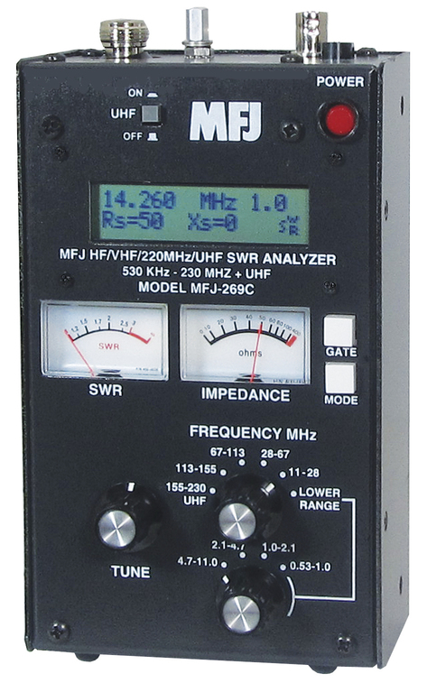
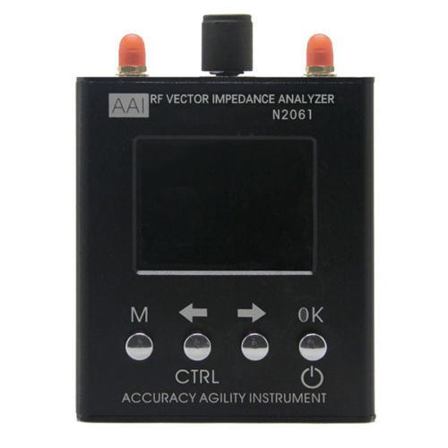
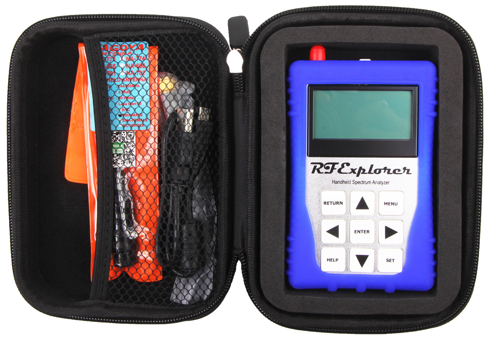

The ability to borrow good quality club-owned test equipment by current club members is a major benefit to WCARC club membership. The list of test equipment available for loan to members is as follows:

* [MFJ-269 Antenna Analyzer](mfj-269.html) (1.8 – 170 MHz and 415-470 MHz), includes wall-wart power source, and Type N(m) to UHF(f) coaxial adapter. 
* [AAI-N2061SA Handheld Vector Network Analyzer](aai-n2061sa.html) (S11: 1.11–1300 MHz; S21: 1.11–600 MHz); Directivity <35 dB; SMA female test ports. Calibration limited to factory calibration unless member uses external open-short-load calibration kits for SMA and Type N. 
* [RF Explorer WSUB1G+ Handheld Spectrum Analyzer](rf-explorer.html) (50 kHz–960 MHz). Antenna and SMA adapter provided. Recharges over USB. 
