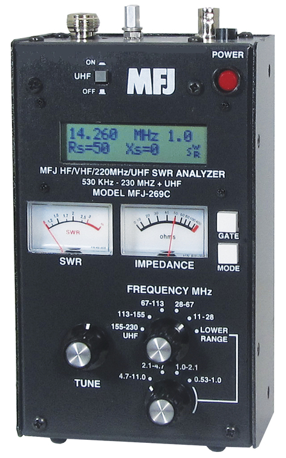

530KHz-230MHz plus 415-470MHz HF/VHF/UHF SWR Analyzer

Covers 530 KHz-230 MHz and 415-470 MHz . . . SWR . . . Complex RFImpedance: Resistance(R) and Reactance(X) or Magnitude(Z) and Phase(degrees) . . . Coax cable loss(dB) . . . Coax cable length and Distance to fault . . . Return Loss . . . Reflection Coefficient . . . Inductance . . . Capacitance . . . Battery Voltage. LCD digital readout . . . frequency counter . . . side-by-side meters . . . Ni-MH/Ni-Cad charger circuit . . . battery saver . . . low battery warning . . . smooth reduction drive . . .

MFJ-269C covers 530KHz to 230 MHz and 415 to 470 MHz -- an MFJ-269C exclusive!
Large easy-to-read two line LCD display and side-by-side meters clearly display your
information. Built-in Ni-Cad/Ni-MH charger circuit, battery saver, low battery warning, smooth reduction drive tuning. Use as signal source for testing/alignment.

Built-in CoaxCalculator -- calculates coax line length in feet given coax length in electrical degrees and vice versa for any frequency and any velocity factor (great for building matching sections and phasing lines) -- an MFJ-269C exclusive!

New 12-bit A/D converter gives much better accuracy and resolution than common 8-bit A/D converters -- an MFJ-269C exclusive!

Super easy to use! Just set the bandswitch and tune the dial -- just like your transceiver.

530 KHz to 230 MHz Range Features

MFJ-269C gives you a complete picture of your antenna. Read antenna SWR and Complex Impedance 530 KHz to 230 MHz. Built-in frequency counter.

Read Complex Impedance as series equivalent resistance and reactance (Rs+jXs) or as magnitude (Z) and phase (degrees). 

Also reads parallel equivalent resistance and reactance (Rp+jXp) --MFJ-269C exclusive!

Determine velocity factor, coax loss in dB, length of coax and distance to short/open in feet.

Reads SWR, return loss and reflection coefficient at any frequency simultaneously at a single glance. Also reads match efficiency.

Also read inductance in uH and capacitance in pF at RF frequencies.

Measure SWR and loss of coax with any characteristic impedance, 10 to over 600 Ohms, including 50, 51, 52, 53, 73, 75, 93,95,300,450 Ohms -- MFJ-269C exclusive!

415 to 470 MHz Range features

Just plug in your UHF antenna coax, set the frequency and read SWR, return loss and reflection coefficient simultaneously. You can read coax cable loss in dB and match efficiency.

You can adjust UHF dipoles, verticals, yagis, quads and other antennas and determine their SWR, resonant frequency and bandwidth.

You can test and tune stubs and coax lines. You can manually determine velocity factor and impedances of transmission lines. 

Adjust and test RF matching networks and RF amplifiers without applying power. 

Has easy-to-read LCD logarithmic SWR bargraph and SWR meter for quick tuning. 

Fully portable, take it anywhere -- on remote sites, up towers, on DX-peditions.

Has built-in “N-type” connector.  Includes Free N-to-SO-239 adaptor.

Use 10 AA Ni-MH or Ni-Cad or alkaline batteries (not included -- alkalines cannot be charged internally) or 110-240 VAC with optional MFJ-1312D (included). 

Compact 4W x 2D x 6 3/4H inches.

[Back to the list of equipment.](./)
