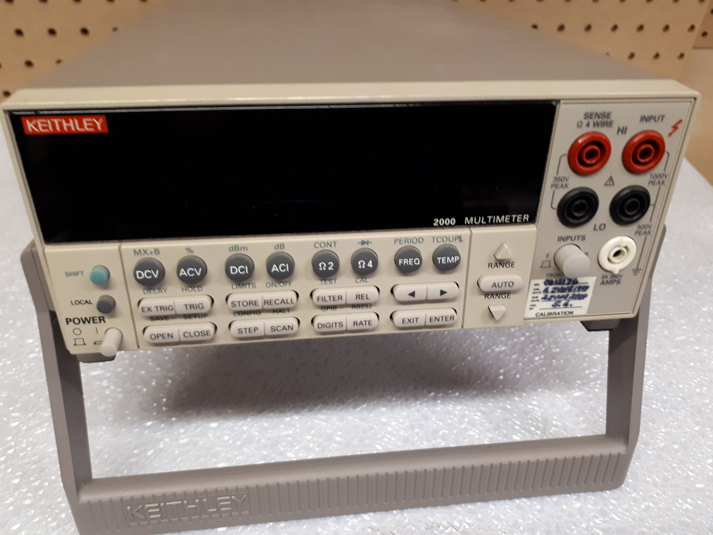
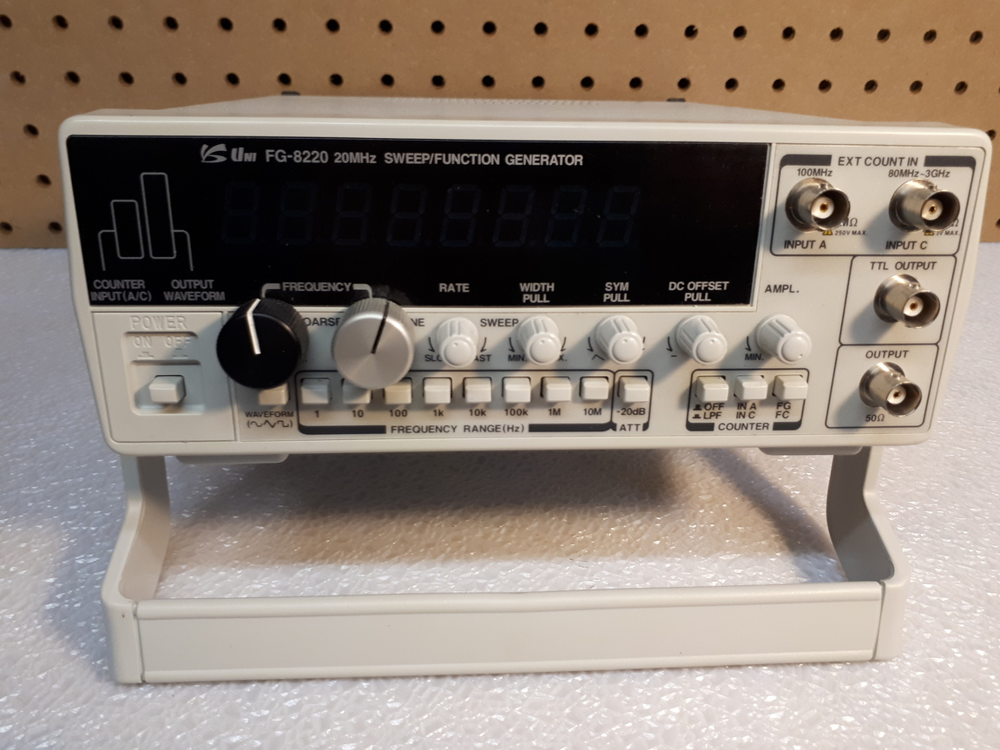
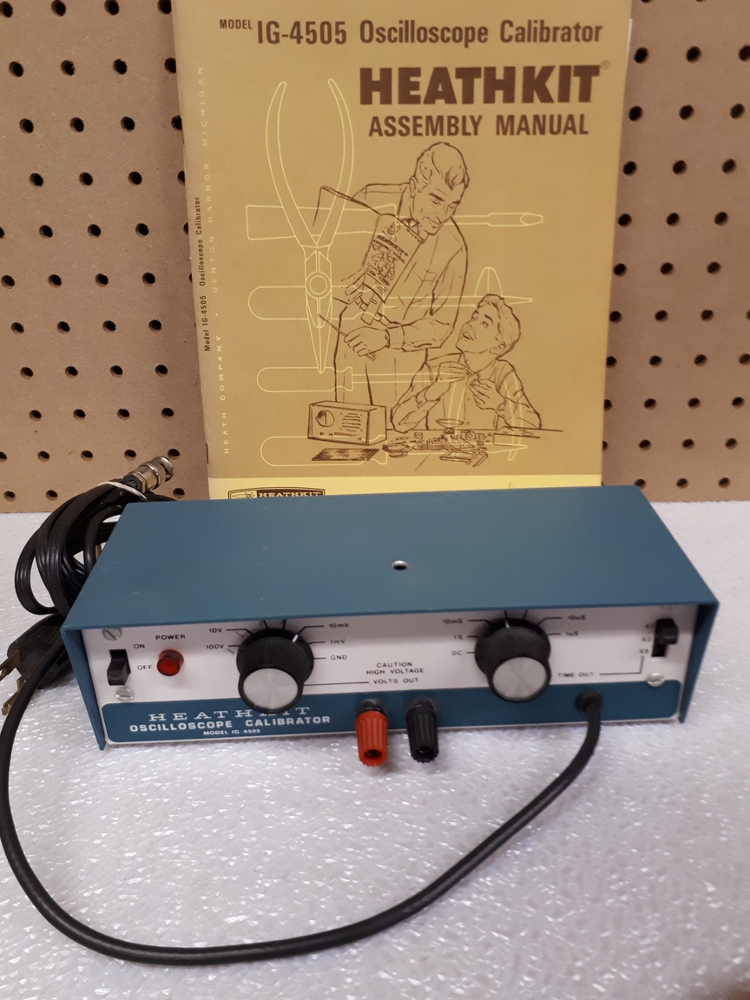

WCARC is offering for sale the following items from the estate of Paul Boltwood VE3PLE (SK).

Both WCARC members and non-members are invited to make an offer on any of the listed equipment by email to [ve3xk@rac.ca](mailto:ve3xk@rac.ca). The period for submission of offers will remain open until midnight, Saturday October 14. All offers will be either accepted or declined by a WCARC Executive Board vote. The Board may choose to list any units on eBay or other sites if no acceptable offers are received. All units include the instruction manual or the download URL. All are now located at VE3XK, 131 Arrowood Dr, Stittsville. Please telephone 613 836 9997 before visiting to inspect a possible purchase. Sold items can be delivered to the next meeting.

-----

### Keithley (div. Tektronix) 2000

Digital multimeter. 6½ digits, GPIB, RS-232. DCV (to 1000 V), true RMS ACV (to 750 V), DCI (to 10 A), true RMS ACI (to 3 A), 2W and 4W resistance (to 100 MΩ), temperature (with probes), frequency (3 Hz to 500 kHz), period, dB, dBm, continuity, diode testing. Optional scanner cards. At 6½ digits it delivers 50 triggered readings/sec over GPIB. At 4½ digits it delivers 2000 readings/sec. Manual: [http://download.tek.com/manual/2000-900_J-Aug2010_User.pdf](http://download.tek.com/manual/2000-900_J-Aug2010_User.pdf)

### Hewlett-Packard 6116A

DC power supply. 6 digits, 1 mV to 100V, 200 mA, constant V or I. Meter. Under 100 µV p-p ripple, noise. 40 µV RMS. Remote programming.

### Uni Source FG-8220

Function & pulse generator. 20 MHz, 4 in 1 sweep, 8-digit frequncy counter 0.1 Hz - 3 GHz. 8 ranges 0.2 Hz to 20 kHz, internal and external sweep control from 1:1 to 10:1. Sine, square, triangle, ramp, pulse, sawtooth and DC outputs. Variable symmetry, variable DC offset control, variable output with 20 dB att.

### Heathkit IG-4505

Oscilloscope calibrator DC and pulse. 1 mV to 100 V; 1 µsec to 0.5 sec.

### Micronta 22-8230 (qty. 3)

Variable DC power supply. 0 to 24 volts, up to 100 mA, current limiting.
