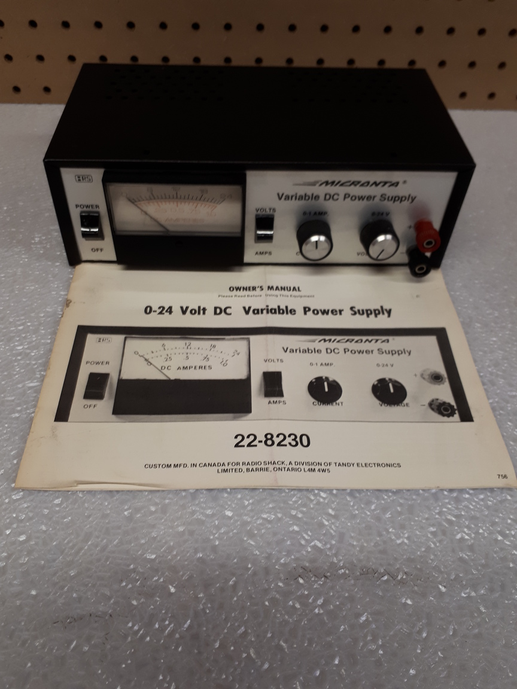

WCARC is offering for sale the following items from the estate of Paul Boltwood VE3PLE (SK).

Both WCARC members and non-members are invited to make an offer on any of the listed equipment by email to [ve3xk@rac.ca](mailto:ve3xk@rac.ca). All offers will be either accepted or declined by a WCARC Executive Board vote. The Board may choose to list any units on eBay or other sites if no acceptable offers are received. All units include the instruction manual or reprint. All are now located at VE3XK, 131 Arrowood Dr, Stittsville. Please telephone 613-836-9997 before visiting to inspect a possible purchase. Sold items can be delivered to the next meeting.

-----

### Micronta 22-8230 (qty. 3)

Variable DC power supply. 0 to 24 volts, up to 1 A, current limiting.
