Several members of WCARC, headed by President Al VO1NO, mounted a grid expedition to FN04xa near Cobourg and Grafton, Ontario, on Friday June 13. The objective was to participate in the annual ARRL VHF Contest, June 14 - 15.

Needless to say, everyone had a great time with plenty of stories of success and frustration. The following photos are not in sequence but give you a good idea of the activity.

WCARC came **first** in Canada and third in their ARRL section. Excellent results!!!

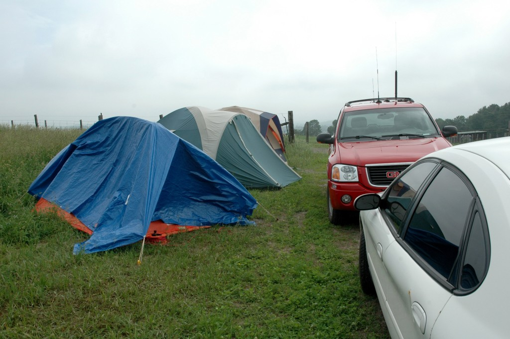

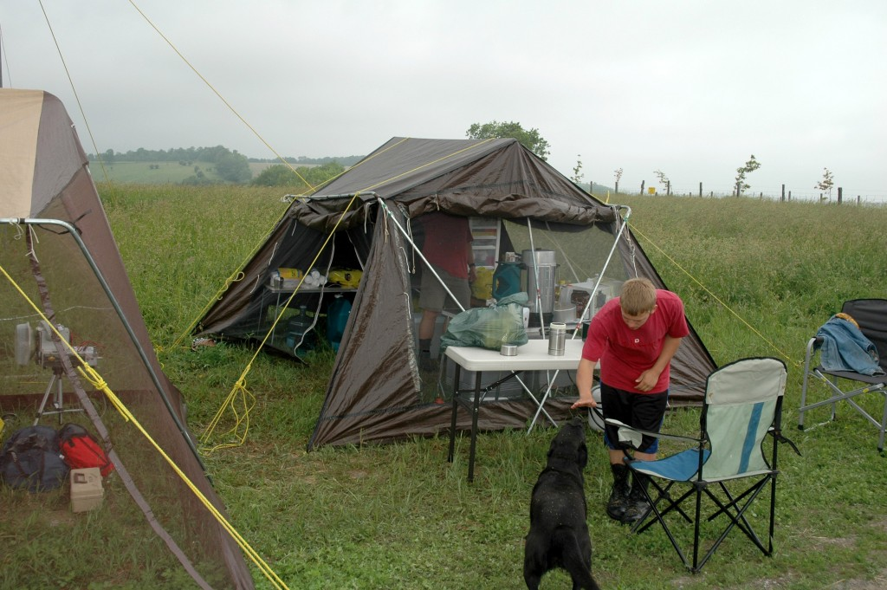

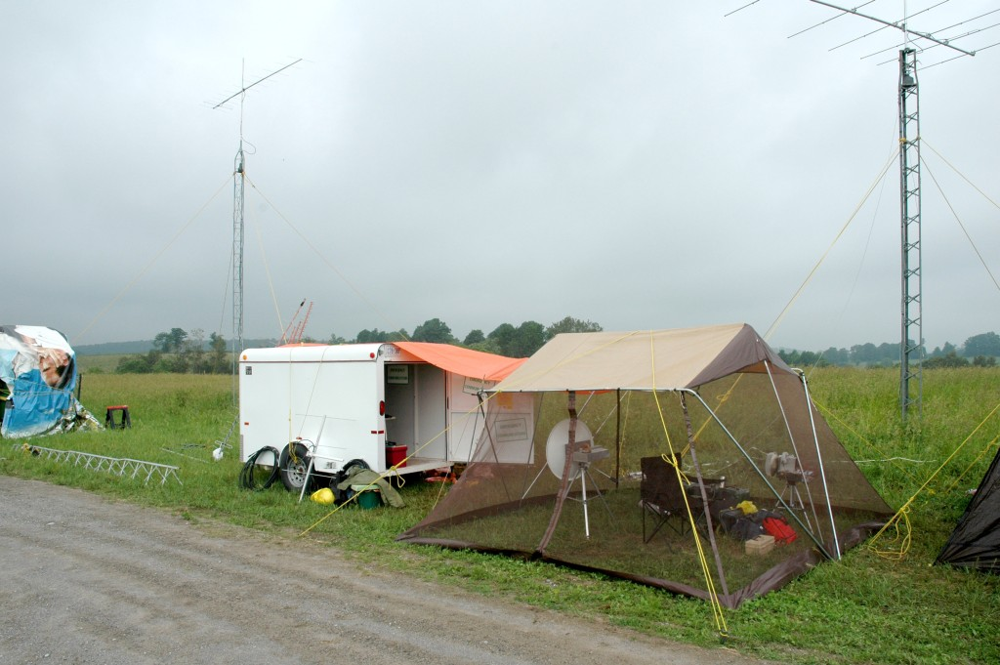

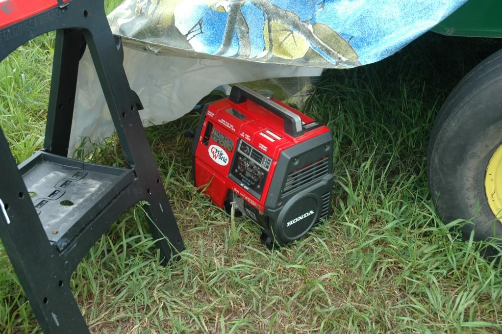

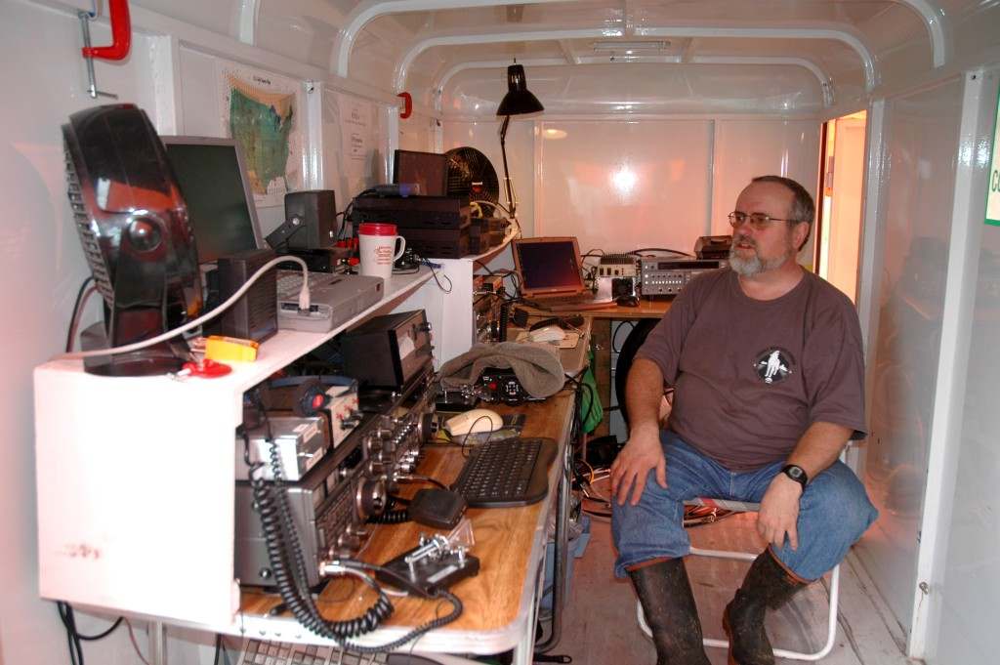

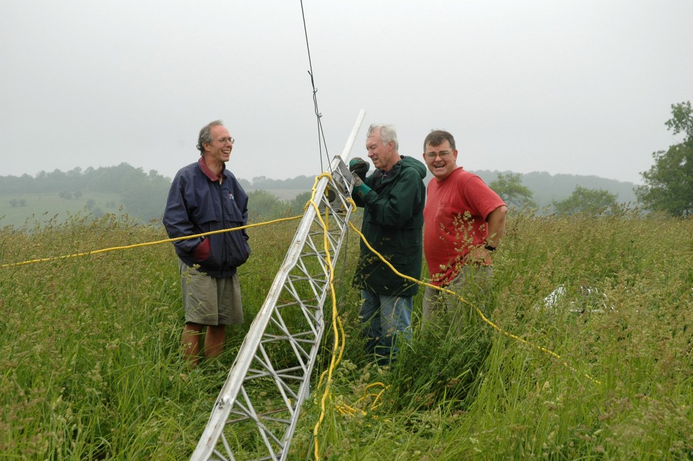

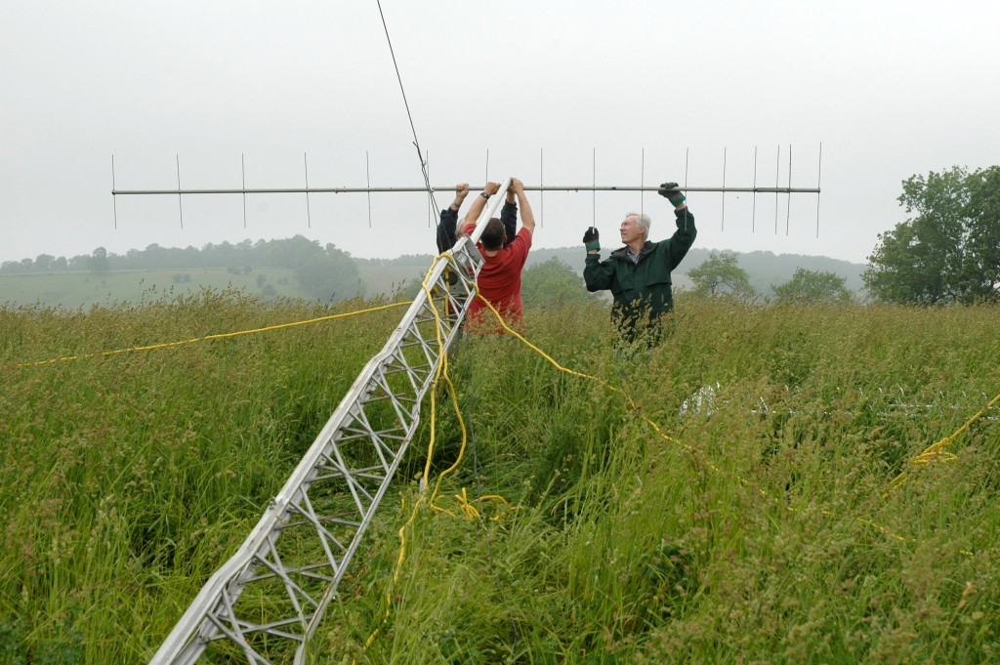

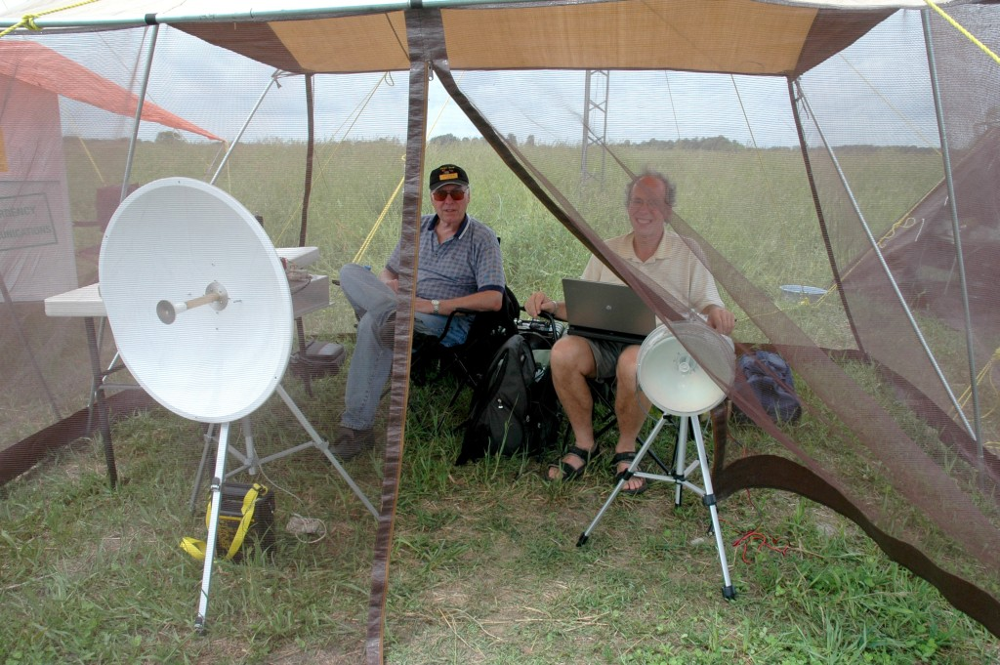

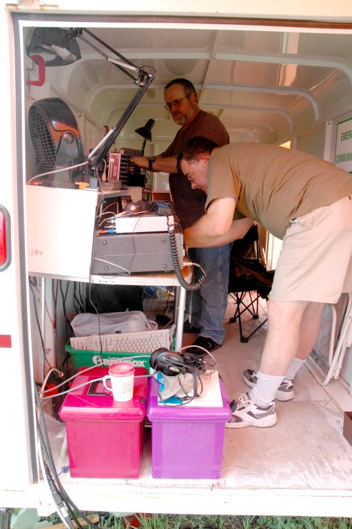

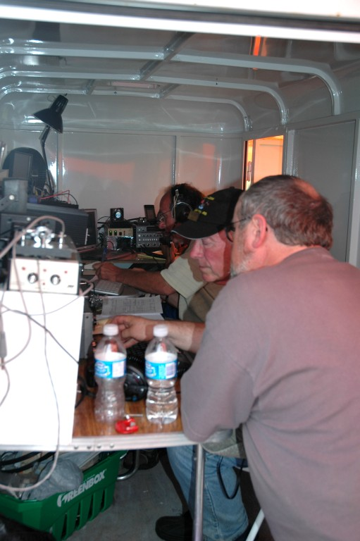

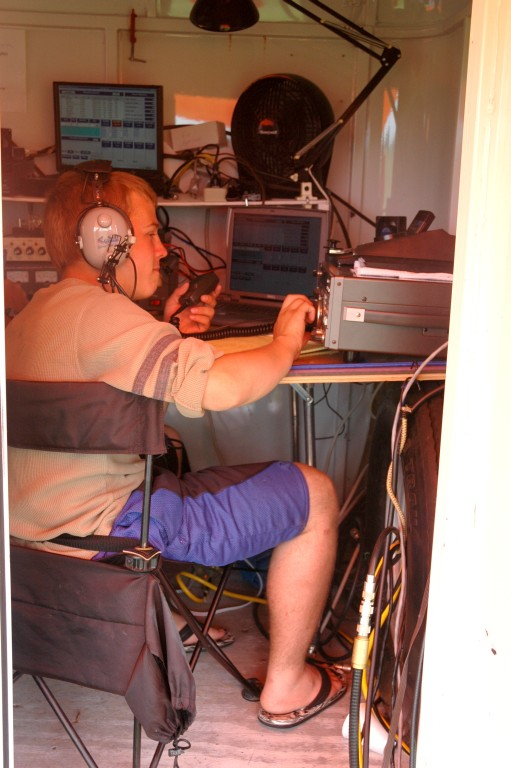

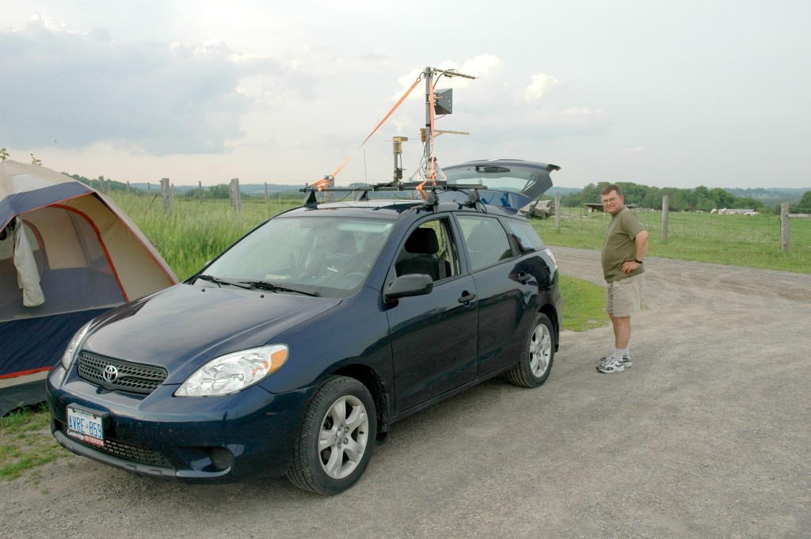

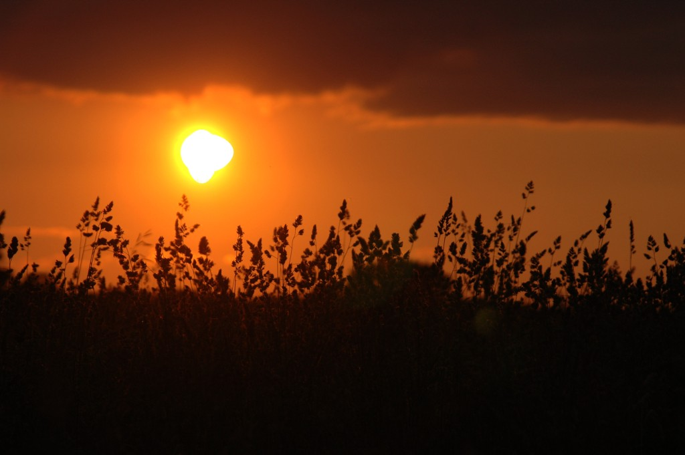

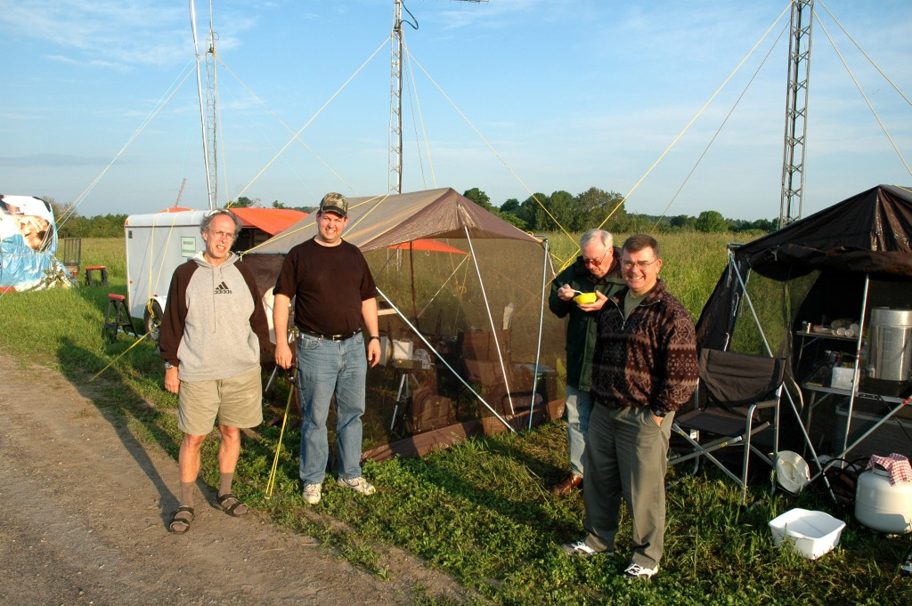
