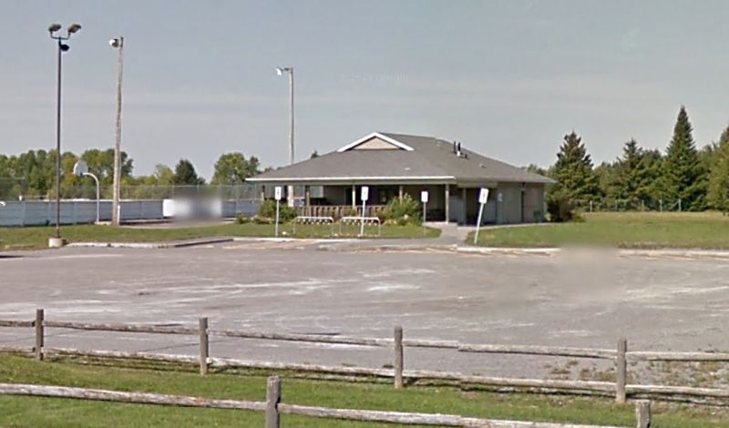

## Message from Glenn MacDonnell (VE3XRA)

The West Carleton Amateur Radio Club of Ottawa will again operate VE3WCC for the June ARRL VHF QSO Party,
our third year at FN15xg after 6 years at FN04xa.

The site is about 30km north of the intersection of FN15, FN25, FN14 and FN24.  Last year we worked rovers operating from FN04xa at bands up to 1296 MHz.

Each year we add capability and/or power.   This year we will run 1kW on 2m, 500W on 6m and 70cm, about 300W on 222MHz and 1296 MHz. We will continue
to use single long yagis but have improved antennas at 2m and 70cm.  We will also operate (but at much lower power) all bands from 2304MHz
through 24GHz and have again included laser communications. If there is interest, we may also include 47GHz. If you expect to contact us and have 47GHz,
please advise before Friday.

We will set up on the site at the Corkery Community Centre 3447 Old Almonte Rd. Ottawa ON,  lat 45.259316 N long -76.060858 W,  on Friday June 10 and pack up Monday June 13.  Visitors are welcome to drop by.  Rovers passing nearby are invited to stop by for a snack and hot coffee.

We'll gladly set up scheds with base stations and rovers who will be within range - please send requests to [ve3xra@rac.ca](mailto:ve3xra@rac.ca).   We will again have internet at the site.

Glenn VE3XRA for VE3WCC.

## Message from the WCARC President, Clayton Smith (VE3IRR)

Hi all,

As many of you probably already know, the West Carleton Amateur Radio Club will once again be participating in the ARRL June VHF Contest the weekend of June 11-12.
Same as last year, we'll be operating close to home, at the Corkery Community Centre, 3447 Old Almonte Rd.  The Community Centre is in grid square FN15xg, just
west of Ottawa. It's about a 15 minute drive from Kanata or Stittsville.  We hope that the closer location will allow more amateurs to participate.

The contest itself begins at 14:00 local time on Saturday, June 11 and continues until 23:00 local time on Sunday, June 12.  But we'll need lots of help on Friday,
June 10 to get towers, antennas, feedlines, radios, amplifiers and computer equipment set up, and on Monday, June 13 to take everything back down.

Rovers who will be within range are asked to forward their rover schedules to Glenn (VE3XRA) [ve3xra@rac.ca](mailto:ve3xra@rac.ca). Please include the grid squares and approximate times you
plan to be in each, a list of bands you are able to operate, and the co-ordination frequency you will use.

Thanks and 73,  
Clayton Smith (VE3IRR)  
President, WCARC

## Message from the WCARC Vice President and Contest Co-ordinator, Doug Leach (VE3XK)

This will be an excellent opportunity to sharpen your
operating skills and enjoy the fellowship of team Amateur Radio communications competition. We will be
running higher power amplifiers on all six bands 6M to 23CM with good
antennas, so we expect to be making an even bigger noise than in
previous years. All we need now is more member participation in this
serious contesting effort.

But WCARC is about much more than VHF Contesting, though we have scored
well in Canada (and once in the ARRL Central Region) in this contest.

Here is a picture of the facility taken from a Google Map Street View.

We will set up 3 towers, in the same sort of arrangement as past years, on the lawns between the parking lot and the building and operate from a large
30' x 15' air conditioned room at the front of the building facing the towers. There are windows along the 30' wall that open at the bottom making it
easy to bring in the cables and the Community Centre provides tables we can use.  We'll set them up along the window and have electricity from the grid -
no generators!  We'll have indoor washrooms and a kitchen complete with freezer, fridge, stove, microwave and the internet.  There are fast food places
a quarter of an hour away and people will be able to bring lunches from home if they want but a full kitchen is tempting.  We haven't yet settled on how
much food preparation we'll do - it really depends on who can come and help.  We are still finding out who can come and when they would be available.  A
very big change will be that most people don't have to commit to a long event and won't need tents or motel rooms as they can return home to sleep in
their own beds!  Downtown Ottawa is about 40 minutes away - Smiths Falls is 48 km.  We will likely have at least one person staying overnight in the
room for security using cots or air mattresses and there is place for that sort of arrangement.

We will have the facility from Friday through Monday and plan a similar schedule as past years: set-up on Friday with finishing setup if required Saturday
morning, operating Saturday afternoon through Sunday evening and take down Monday.  Some setup will be simpler because the power and cooking arrangements
are already in place.  We have the cables and supplies from last year but the putting together of antennas and
towers will take time.  We have already checked out the tower locations and marked positions for the towers and stakes and have assembled
and checked the cables.  As it turned out we have been able to find all the radio equipment and computers we need.
