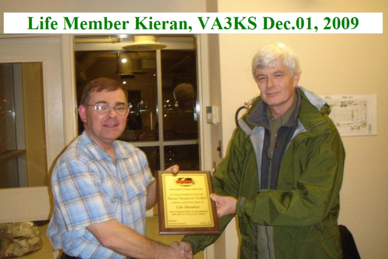
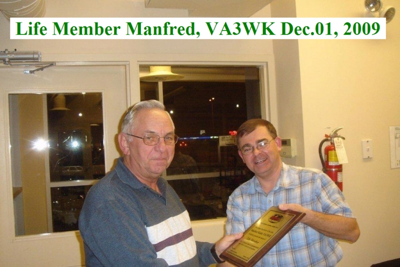
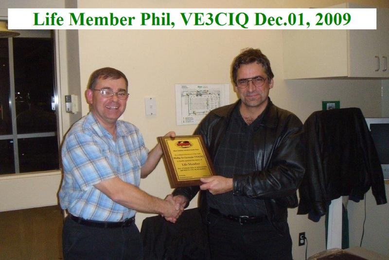

## Constitution of the WCARC

* [Constitution of the West Carleton Amateur Radio Club](constitution/wcarc-constitution.html)
* [Bylaws to the Constitution of the West Carleton Amateur Radio Club](constitution/wcarc-bylaws.html)
* [Special Information Attachment to the Constitution of the West Carleton Amateur Radio Club](constitution/wcarc-specialinfo.html)

## Membership and Dues

Membership in the club is open to all radio amateurs, and those planning to become radio amateurs. Our membership fee (dues) remain $25 per year for 2018 and entitle the
member to full membership privileges. While attendance of meetings is not mandatory, the nature of this club is to promote and encourage a participatory membership.

Membership entitles members use of certain equipment and may also entitle members to a discount on certain projects or equipment, as determined by the club from time
to time.

This club avails itself of certain [insurance protection available from Radio Amateurs of Canada](http://blog.rac.ca/?p=1844). To that end, all members who are not already members of RAC,
including family members who are not members of RAC, must make this known to the Treasurer and will be assessed an adjustment amount, equal to the additional amount required by RAC to continue the insurance policy for the club.

Use our [application form](application.html) to register as a new member, update
your contact information or request to be added to our mailing list.

## Life Members

We are proud to introduce our Life Members. These individuals have made extraordinary contributions to West Carleton Amateur Radio Club.

## Members

### 2014

| Call | Name | QTH | Grid Square |
| --- | --- | --- | --- |
| VA3KS | Kieran Shepherd | Ottawa | FN25 |
| VA3WK | Manfred Kahle | Ottawa | FN25 |
| VE3CIQ | Phil St-Germain | Carleton Place | FN15 |
| VE2ZAZ | Bert Zauhar | Gatineau | FN25 |
| VA3PJ | Peter Jago | Stittsville | FN25 |
| VA3YH | Ying Hum | Ottawa | FN25 |
| VA3BGB | Barney Baker | Kanata | FN25ai |
| VA3CDD | Dean Denter | Woodlawn | FN15wl |
| VE3XK | Doug Leach | Stittsville | FN25 |
| VE3BYT | Graham Ide | Nepean | FN25ch |
| VE3CZO | Wayne Getchell | Ottawa | FN25 |
| VE3IRR | Clayton Smith | Kanata | FN25ai |
| VE3NPC | Claire Fowler | Ottawa | FN25 |
| VE3NVK | Andy Hart | Kanata | FN25 |
| VE3PLE | Paul Boltwood | Stittsville | FN25bg |

Note: List is incomplete.

### 2013

| Call | Name | QTH | Grid Square |
| --- | --- | --- | --- |
| VA3KS | Kieran Shepherd | Ottawa | FN25 |
| VA3WK | Manfred Kahle | Ottawa | FN25 |
| VE3CIQ | Phil St-Germain | Carleton Place | FN15 |
| VE2ZAZ | Bert Zauhar | Gatineau | FN25 |
| VE3XK | Doug Leach | Stittsville | FN25 |
| VA3KA | Ken Asmus | Carp | FN15wg |
| VE3CVG | Rick Bandla | Cumberland | FN25hm |
| VE3NPC | Claire Fowler | Ottawa | FN25 |
| VE3NVK | Andy Hart | Kanata | FN25 |
| VE3XRA | Glenn MacDonell | Ottawa | FN25 |
| VO1NO | Al Penney | Merrickville | FN24cw |
| VE3IRR | Clayton Smith | Kanata | FN25 |
| VA3YH | Ying Hum | Ottawa | FN25 |
| VE3CZO | Wayne Getchell | Ottawa | FN25 |

Note: List is incomplete.

### 2012

| Call | Name | QTH | Grid Square |
| --- | --- | --- | --- |
| VA3KS | Kieran Shepherd | Ottawa | FN25 |
| VA3WK | Manfred Kahle | Etobicoke | TBD |
| VE3CIQ | Phil St-Germain | Carleton Place | FN15 |
| VA3KA | Ken Asmus | Carp | FN15wg |
| VA3PJ | Peter Jago | Stittsville | FN25 |
| VA3BGB | Barney Baker | Kanata | FN25ai |
| VA3BMZ | Bernie Madore | Almonte | FN15 |
| VA3CDD | Dean Denter | Woodlawn | FN15wl |
| VA3SMM | Stan Madore | Almonte | FN15 |
| VA3UNK | Harold Hamilton | Ottawa | FN25dj |
| VE2ZAZ | Bert Zauhar | Gatineau | FN25 |
| VE3XK | Doug Leach | Stittsville | FN25 |
| VE3CFZ | Fred Chamberlain | Almonte | FN15ve |
| VE3CVG | Rick Bandla | Cumberland | FN25hm |
| VE3EFF | Jeff Milne | Stittsville | FN25 |
| VE3ELM | Tom Bartello | Almonte | FN15 |
| VE3NPC | Claire Fowler | Ottawa | FN25 |
| VE3NVK | Andy Hart | Kanata | FN25 |
| VE3XRA | Glenn MacDonell | Ottawa | FN25 |
| VE3XZT | Dale Hennigar | Almonte | FN15 |
| VE3YTZ | Greg Danylchenko | Ottawa | FN25 |
| VO1NO | Al Penney | Merrickville | FN24cw |

Note: List is incomplete.

### 2011

| Call | Name | QTH | Grid Square |
| --- | --- | --- | --- |
| VA3KS | Kieran Shepherd | Ottawa | FN25 |
| VA3WK | Manfred Kahle | Ottawa | FN25 |
| VE3CIQ | Phil St-Germain | Carleton Place | FN15 |
| VA3KA | Ken Asmus | Carp | FN15wg |
| VA3PJ | Peter Jago | Stittsville | FN25 |
| *VA3WO | Valentin Doroga | Ottawa | FN25 |
| VA3BGB | Barney Baker | Kanata | FN25ai |
| VA3BMZ | Bernie Madore | Almonte | FN15 |
| *VA3NFA | Tom Zinck | Kanata | FN25bh |
| *VA3OMP | Greg Speakman | Kanata | FN25 |
| VA3SMM | Stan Madore | Almonte | FN15 |
| VA3UNK | Harold Hamilton | Ottawa | FN25dj |
| VE2ZAZ | Bert Zauhar | Gatineau | FN25 |
| *VE3KL | Dave Conn | Ottawa | FN25bh |
| VE3XK | Doug Leach | Stittsville | FN25 |
| *VE3BYT | Graham Ide | Nepean | FN25ch |
| VE3CFZ | Fred Chamberlain | Almonte | FN15ve |
| *VE3CRG | Brian Crook | Stittsville | FN25 |
| VE3CVG | Rick Bandla | Cumberland | FN25hm |
| *VE3DMU | David Frank | Fallowfield | FN25cg |
| VE3EFF | Jeff Milne | Stittsville | FN25 |
| VE3ELM | Tom Bartello | Almonte | FN15 |
| *VE3KEJ | Jim Bos | Fitzroy Hrbr | FN15 |
| *VE3KID | Geoff Johnson | Fallowfield | FN25 |
| *VE3KKB | Doug Griffith | Ashton | FN15 |
| VE3NPC | Claire Fowler | Ottawa | FN25 |
| VE3NVK | Andy Hart | Kanata | FN25 |
| VE3XRA | Glenn MacDonell | Ottawa | FN25 |
| VE3XZT | Dale Hennigar | Almonte | FN15 |
| VO1NO | Al Penney | Merrickville | FN24cw |

### 2010

| Call | Name | QTH | Grid Square |
| --- | --- | --- | --- |
| VA3KS | Kieran Shepherd | Ottawa | FN25 |
| VA3WK | Manfred Kahle | Ottawa | FN25 |
| VE3CIQ | Phil St-Germain | Carleton Place | FN15 |
| VA3KA | Ken Asmus | Carp | FN15wg |
| VA3PJ | Peter Jago | Stittsville | FN25 |
| VA3WO | Valentin Doroga | Ottawa | FN25 |
| VA3BGB | Barney Baker | Kanata | FN25ai |
| VA3BMZ | Bernie Madore | Almonte | FN15 |
| VA3CDD | Dean Denter | Woodlawn | FN15wl |
| VA3DRV | Marc Pichette | Ottawa | FN25 |
| VA3NFA | Tom Zinck | Kanata | FN25bh |
| VA3OMP | Greg Speakman | Kanata | FN25 |
| VA3SMM | Stan Madore | Almonte | FN15 |
| VE2ZAZ | Bert Zauhar | Gatineau | FN25 |
| VE3FN | Ray Perrin | Ottawa | FN25 |
| VE3KL | Dave Conn | Ottawa | FN25bh |
| VE3XK | Doug Leach | Almonte | FN15 |
| VE3BSM | Brad Smith | Merrickville | FN24 |
| VE3BYT | Graham Ide | Nepean | FN25ch |
| VE3CVG | Rick Bandla | Cumberland | FN25hm |
| VE3ELM | Tom Bartello | Carp | FN15 |
| VE3IAO | John Christensen | Almonte | FN15 |
| VE3IFP | Murray Pierce | Almonte | FN15 |
| VE3MMQ | Bill Brown | Sharbot Lake | FN14 |
| VE3NPC | Claire Fowler | Ottawa | FN25 |
| VE3NVK | Andy Hart | Kanata | FN25 |
| VE3UIN | Andrew Wollin | Kingston | FN |
| VA3UNK | Harold Hamilton | Ottawa | FN25dj |
| VE3UNW | Richard Hagemyer | Ottawa | FN25 |
| VE3WMB | Michael Babineau | Ottawa | FN25 |
| VE3XRA | Glenn MacDonell | Ottawa | FN25 |
| VE3XZT | Dale Hennigar | Almonte | FN15 |
| VE3YTZ | Greg Danylchenko | Ottawa | FN25 |
| VE3ZTU | Alan MacPhee | Ottawa | FN25 |
| VO1NO | Al Penney | Merrickville | FN24cw |

### 2009

| Call | Name | QTH | Grid Square |
| --- | --- | --- | --- |
| VA3BGB | Barney Baker | Kanata | FN25ai |
| VA3BMZ | Bernie Madore | Almonte | FN15 |
| VA3CDD | Dean Denter | Woodlawn | FN15wl |
| VA3DGN | Tyler Tidman | Ottawa | FN25 |
| VA3JPG | JP Gendron | Ottawa | FN25 |
| VA3KA | Ken Asmus | Carp | FN15wg |
| VA3KS | Kieran Shepherd | Ottawa | FN25 |
| VA3NFA | Tom Zinck | Kanata | FN25bh |
| VA3PJ | Peter Jago | Stittsville | FN25 |
| VA3SMM | Stan Madore | Almonte | FN15 |
| VA3UNK | Harold Hamilton | Ottawa | FN25dj |
| VA3WK | Manfred Kahle | Ottawa | FN25 |
| VA3WO | Valentin Doroga | Ottawa | FN25 |
| VE2ZAZ | Bert Zauhar | Gatineau | FN25 |
| VE3BYT | Graham Ide | Nepean | FN25ch |
| VE3CIQ | Phil St-Germain | Carleton Place | FN15 |
| VE3CVG | Rick Bandla | Cumberland | FN25hm |
| VE3ELM | Tom Bartello | Carp | FN15 |
| VE3IAO | John Christensen | Almonte | FN15xi |
| VE3KL | Dave Conn | Ottawa | FN25bh |
| VE3LWX | Stephen Mayne | Carleton Place | FN15 |
| VE3LZV | Ed Blaser | Kanata | FN25 |
| VE3NNQ | Bill Brown | Sharbot Lake | FN14 |
| VE3NVK | Andy Hart | Kanata | FN25 |
| VE3THZ | Travis Hein | Kanata | FN25 |
| VE3UNW | Richard Hagemeyer | Ottawa | FN25 |
| VE3UU | Brian Jeffrey | Carp | FN15 |
| VE3XK | Doug Leach | Carp | FN15wg |
| VE3XRA | Glen MacDonell | Ottawa | FN25 |
| VE3XZT | Dale Hennigar | Almonte | FN15 |
| VO1NO | Al Penney | Merrickville | FN24cw |

### 2008

| Call | Name | QTH | Grid Square |
| --- | --- | --- | --- |
| VA3BGB | Barney Baker | Kanata | FN25ai |
| VA3CDD | Dean Denter | Woodlawn | FN15wl |
| VA3KA | Ken Asmus | Carp | FN15wg |
| VA3NFA | Tom Zinck | Kanata | FN25bh |
| VA3SAX | Steve Attfield | Kanata | FN25 |
| VA3UNK | Harold Hamilton | Ottawa | FN25dj |
| VA3WK | Manfred Kahle | Nepean | FN25 |
| VA3WO | Valentin Doroga | Kanata | FN25 |
| VA3XK | Rene Kahle | Nepean | FN25 |
| VE2ZAZ | Bert Zauhar | Gatineau | FN25 |
| VE3BSM | Brad Smith | Merrickville | FN24cw |
| VE3BYT | Graham Ide | Nepean | FN25ch |
| VE3CVG | Rick Bandla | Cumberland | FN25hm |
| VE3DW | Bill Reed | Carp | FN15 |
| VE3ELM | Tom Bartello | Carp | FN15 |
| VE3IAO | John Christensen | Carp | FN15xi |
| VE3KL | Dave Conn | Ottawa | FN25bh |
| VE3MY | Tim Evangelatos | Kanata | FN25el |
| VE3NVK | Andy Hart | Kanata | FN25 |
| VE3UNW | Richard Hagemeyer | Ottawa | FN25 |
| VE3UU | Brian Jeffrey | Carp | FN15 |
| VE3XK | Doug Leach | Carp | FN15wg |
| VE3XZT | Dale Hennigar | Almonte | FN15 |
| VE3YTZ | Greg Danylchenko | Ottawa | FN25 |
| VO1NO | Al Penney | Merrickville | FN24cw |
| W4TAA | Bill Brown | Almonte | FN15 |
| no call | Stan Madore | Almonte | FN15 |
| no call | Bernie Madore | Almonte | FN15 |

### 2007

| Call | Name | QTH | Grid Square |
| --- | --- | --- | --- |
| VA3BGB | Barney Baker | Kanata | FN25ai |
| VA3BZQ | Les McCready | Carleton Place | FN15ai |
| VA3CDD | Dean Denter | Woodlawn | FN15wl |
| VA3KA | Ken Asmus | Carp | FN15wg |
| VA3KS | Kieran Shepherd | Carp | FN15wg |
| VA3NFA | Tom Zinck | Kanata | FN25bh |
| VA3RKM | Bob MacKenzie | Ottawa | FN25 |
| VA3SAX | Steve Attfield | Kanata | FN25 |
| VA3UNK | Harold Hamilton | Ottawa | FN25dj |
| VA3WK | Manfred Kahle | Ashton | FN25 |
| VA3XK | Rene Kahle | Ashton | FN25 |
| VA3ZK | Frank Kahle | Ashton | FN25 |
| VE3AKV | Bob Clermont | Carleton Place | FN15vb |
| VE3BSM | Brad Smith | Merrickville | FN24cw |
| VE3BYT | Graham Ide | Nepean | FN25ch |
| VE3CIQ | Phil St-Germain | Carleton Place | FN15 |
| VE3CVG | Rick Bandla | Cumberland | FN25hm |
| VE3ELM | Tom Bartello | Carp | FN15 |
| VE3IAO | John Christensen | Carp | FN15xi |
| VE3KL | Dave Conn | Ottawa | FN25bh |
| VE3LZV | Ed Blaser | Kanata | FN25 |
| VE3MY | Tim Evangelatos | Kanata | FN25el |
| VE3NVK | Andy Hart | Kanata | FN25 |
| VE3PPE | Gord Dey | Kinburn | FN15 |
| VE3PZ | Pat Stever | Gloucester | FN25 |
| VE3QMM | Mike MacGregor | Carleton Place | FN15wb |
| VE3QYR | Justin Schmidt Clever | Kanata | FN25 |
| VE3UIX | Robb Webb | Carp | FN15 |
| VE3UNW | Richard Hagemeyer | Ottawa | FN25 |
| VE3UU | Brian Jeffrey | Carp | FN15 |
| VE3XK | Doug Leach | Carp | FN15wg |
| VE3XZT | Dale Hennigar | Almonte | FN15 |
| VE3YTZ | Greg Danylchenko | Ottawa | FN25 |
| VO1NO | Al Penney | Merrickville | FN24cw |
