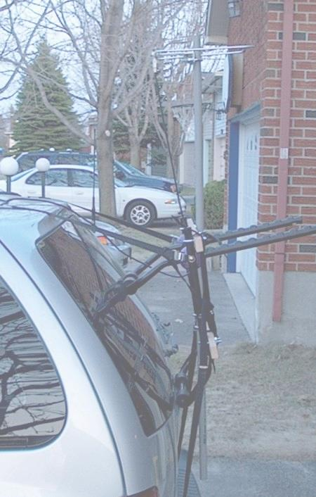
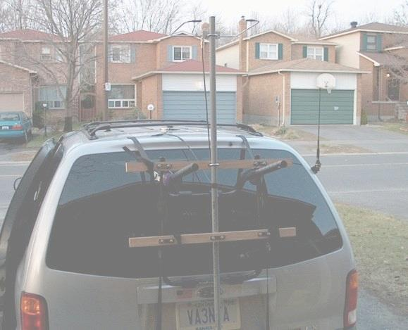
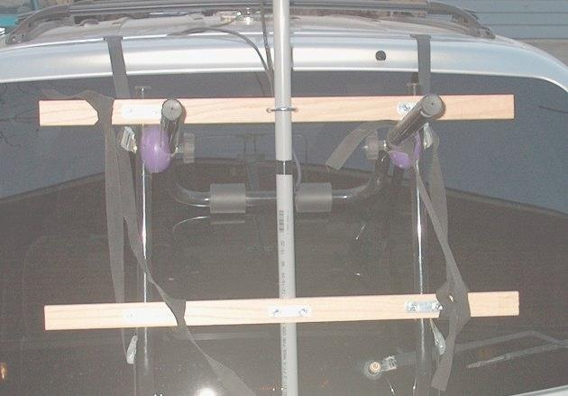

In January I said: Hmmmmm... "VA3NFA Psycho Rover" for the June VHF Contest......

Here are a few pics of my "Mk 1" Rover mount/mast setup with the 144 loop installed. I am using a
Canadian Tire bike rack for a base, with two pieces of 1x3 oak as the cross pieces to mount the mast on.

I am using 3/4 plastic conduit for mast and I think I will swap it out with 1" aluminum tube or maybe 3/4
metal conduit.

I will have three antennas (144, 222, 432) on this mobile mast, so I want  it to be strong. (ed. note: what
about 903 and 1296?)

I can take off the entire setup in one piece in about 5 minutes and there are no holes/mods to the van.
perfect!

It is even adjustable so I can lower the mast and drive in my garage.. life is good!

Next steps:

* Waterproof the oak and connectors. ;-)
* New mast
* Add the 432 loop and a duplexer
* Add an intravenous drip for coffee

I will not consider this a "psycho rover" until I have
at LEAST 5 bands installed ;-)

Thanks for the help testing tonight.. lots of fun! I am more than just a little annoyed that my mobile
setup has better signal reports, at least from where I was parked, than base base setup. I am starting to see
the real appeal of roving and the importance of location!

Tom (VA3NFA)

73, Tom (VA3NFA) Kanata, Ontario

Editor's Note: This is Tom's set up for operating while in motion. Good job Tom! Tom's stationary set up includes a taller mast and all horizontal yagis.
