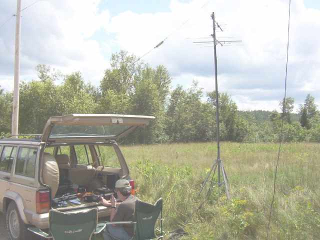

Jim (VE3XJ) and I made an excursion Sunday August 1, 2004, to the intersection of FN16 and FN26, to activate those grids on 6m, 2m, and 70cm.

It was a really enjoyable exercise. We used my call VE3CVG/2. The Operators were Jim (VE3XJ) and myself, Rick (VE3CVG).

## Our Equipment

Antennas: 4 element yagi on 2m, 6 elements on 70cm, wire dipole on 6m. The 2m and 70cm yagis were supported on a 8 foot steel TV mast held in a RS roof mount tripod. One end of the 6m dipole was tied to the jeep roof rack and the other was on a 16 foot yellow mast/tripod used to hold halogen spot lights. The yellow tripod was counter-tethered with a single rope and tent peg.

Radio: Jim's Yaesu FT897 running 100w on 6m, 50w on 2m and 20w on 70cm. Excellent radio. We were powered by an 18 AHr gel cell. Backup power was a power cord that wcould plug into the jeeps accessory connector.

## Location

For those of you who would like to duplicate our efforts, getting there is quite straight forward, but you might want to take a GPS for locating and a compass for aiming antennas. Go north from Hull, QC on route 105.

The turn from Autoroute 105 to LaChappelle Road is at 46 07 05.3N 76 00 18.6W. The position for the FN16 station was 46 06 57.5N 76 00 00.5W. The position for the FN26 station was 46 06 59.3N 75 59 52.4W.

The immediate terrain at the location we chose was more or less elevated or flat for 1000 yards in all directions. However, from our travels we know that we were down in a bowl. Our elevation was about 150m at that point and we had passed over hills of 245m or more while getting there.

We did not want to park by the highway and provide target practice or distractions for the motorists so we were fortunate to find LaChappelle Rd. basically a compacted sand and gravel road cutting diagonally right (north east) off route 105. There were good places to pull into the deep grass on both sides of the road and almost no traffic. Perfect.

Here is a picture of the installation with VE3XJ at the mic.

It took us about 15 minutes to set up the first time and about 10 minutes to relocate and re-setup twice after that. We aimed our antennas by compass and pointed to a notch in the distant hills. It worked well. We later tried turning antennas and found lots of reflection but our first antenna heading was the best.

We calculated our distance as just about 100km from VA3KA.

## Results

Stations checking in included Ken (VA3KA), Doug (VE3XK) and Manfred (VA3WK). We worked Ken in both grids on 6m, 2m and 70cm with good Q5 signals. We worked Doug on 6m and 2m in both grids, with good signals, and heard him Q3 to Q5 on 70cm  from both grids, but he was not able to copy us well enough to call it a contact on 70cm. We worked Manfred on 2m from FN16 on 2m.

This is the relevent log for VE3CVG/VE2. All times are UTC. All dates are 2004, August 1 UTC.

1. VA3KA    FN15 FN26 144.200
2. VA3KA    FN15 FN26 50.160
3. VA3KA    FN15 FN26 432.100
4. VA3KA    FN15 FN16 144.200
5. VA3WK    FN15 FN16 144.200
6. VA3KA    FN15 FN16 50.160
7. VA3KA    FN15 FN16 432.100
8. VE3XK    FN15 FN16 144.200
9. VE3XK    FN15 FN16 50.160
10. VE3XK    FN15 FN16 432.100 was heard Q3 by us - no contact
11. VE3XK    FN15 FN26 144.200
12. VE3XK    FN15 FN26 50.160
13. VE3XK    FN15 FN26 432.100 was heard Q4-Q5 by us - no contact
