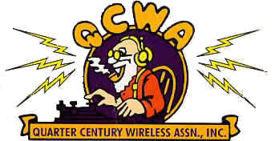

By Ken Asmus VA3KA and Rick Bandla VE3CVG

As Presented at
October 15-17, 2004 QUARTER CENTURY WIRELESS ASSOCIATION Conference  
Lord Elgin Hotel, Ottawa, Ontario, Canada

## Table of Contents

* Introduction
* Common HF Modes include RTTY, TOR modes (AMTOR, PACTOR), CLOVER, HELL, MFSK, MT63, Packet, SSTV, PSK-31
* Hardware
* Software
* Getting started
* Internet Resources
* Acknowledgements
* Discussion, questions and demo

## Introduction

* Thanks to the generosity of radio hams with programming knowledge, the World Wide Web and the availability of personal computers, new and powerful communications tools are available to all hams.
* We can all participate in the revolution by trying out these modes and judging their performance on all of the HF bands.
* This presentation will provide a summary of the most common digital modes in use today and how you can get on the air with only a little effort!

## RTTY

* "Radio Teletype" is an FSK (Frequency Shift Keying) mode that has been in use longer than any other digital mode
* RTTY is a very simple technique which uses a five-bit code to represent all the letters of the alphabet, the numbers, some punctuation and some control characters
* 45 baud (typically) corresponds to a typing speed of 60 WPM.
* There is no error correction provided in RTTY; noise and interference can have a seriously detrimental effect
* Recent resurgence due to use of sound cards and DSP software
* Very popular contesting mode

<audio src="digital_on_hf/rtty.wav" controls="controls"></audio>

## AMTOR

* AMateur Teleprinting Over Radio
* Derived from the commercial SITOR system (Simplex Telex Over radio) developed primarily for Maritime use in the 1970s.
* In the early 1980's, Peter Martinez, G3PLX, made several minor changes to the SITOR protocol and called it AMTOR
* AMTOR improves on RTTY by incorporating a simple Error Detection technique
* AMTOR performs well even in poor HF conditions and the result is quite tolerable for normal text mode conversations
* There are two modes used in AMTOR: ARQ and FEC
* Data is sent in groups of 3 characters (ARQ)
* The receiver responds to each 3 character group by sending either an ACK (ACKnowledge) code (if OK) or a NAK (Negative AcKnowledge). Each time the transmitting station gets a NAK, that 3 character group is sent again.
* In FEC mode (Forward Error Correcting), sometimes called Mode B, the sending station sends each character twice so this mode provides a means of transmitting to several stations at once. The receiving station does not acknowledge the data received
* AMTOR systems are still limited to the technology of the 60s and maximum transmission rate (100 baud)

<audio src="digital_on_hf/amtor.wav" controls="controls"></audio>

## PACTOR

* FSK mode and is a standard on modern TNCs
* Combination of packet and AMTOR Techniques
* The most popular ARQ digital mode on amateur HF today
* 200 baud operating rate, Huffman compression technique and true binary data transfer capability makes this mode suitable for HF data file transfers
* Many RF/INTERNET gateways worldwide using PACTOR and the WinLink Network

<audio src="digital_on_hf/pactor.wav" controls="controls"></audio>

## Winlink

* Winlink 2000 provides a full-featured radio digital message transfer system, [**worldwide**](http://winlink.org/userPositions)
* Email transfer with attachments, map & text-based position reporting, graphic & text-based weather bulletin services, and emergency communications are now available to the Amateur radio community by linking radio to the Internet using PACTOR on the HF Bands
* The mobile user, whether on the high seas, jungles of a remote region, or travelling in an RV,  has the ability to provide family and friends with the state of their safety and well-being along with the joys of their travels.
* **The Winlink 2000 system is currently used for  emergency communications where local or regional  communications are disrupted, including the the loss of the Internet, and where accuracy of information is paramount.**

## PACTOR II

* Robust and powerful PSK mode which operates well under varying conditions
* Uses strong logic, automatic frequency tracking; it is DSP based
* As much as 8 times faster then PACTOR 1
* Both PACTOR and PACTOR-2 use the same protocol handshake, making the modes compatible

## PACTOR III

* Proprietary mode used for message and traffic handling over an HF radio circuit
* Use of PACTOR-III protocol is limited for NA hams and some other countries due to the very wide bandwidth
* Only the embedded hardware (modem) from the German company that owns the rights to this mode, is capable of operating PACTOR-III.
* No software solution available
* EXPENSIVE modems!

## CLOVER

* PSK mode which provides a full duplex simulation
* Suited for HF operation (especially under good conditions)
* Clover's key characteristics are band-width efficiency with high error-corrected data rates
* Clover adapts to conditions by constantly monitoring the received signal
* Hardware based mode and limited use

<audio src="digital_on_hf/clover.wav" controls="controls"></audio>

## HELLSCHREIBER

* A method of sending and receiving text using facsimile technology
* This mode has been around a long time; the recent use of PC sound cards as DSP units has increased the interest in Hellschreiber
* The single-tone version (Feld-Hell) is the method of choice for HF operation
* 35 WPM text rate, with a narrow bandwidth (about 75 Hz).
* Text characters are "painted" on the screen, as apposed to being decoded and printed
* As a "fuzzy mode" it has the advantage of using the "human processor" for error correction.

<audio src="digital_on_hf/hell.wav" controls="controls"></audio>

## MFSK16

* An advancement to the THROB mode and encodes 16 tones
* Uses Fast Fourier Transform technology to decode the ASCII characters, and Constant Phase Frequency Shift Keying to send the coded signal. Continuous Forward Error Correction (FEC) sends all data twice with an interleaving technique to reduce errors from impulse noise and static crashes
* The relatively wide bandwidth (316 Hz) for this mode allows faster baud rates (typing is about 42 WPM) and greater immunity to multipath phase shift
* Becoming a standard for reliable keyboard to keyboard operation and is available in several popular programs

<audio src="digital_on_hf/mfsk16.wav" controls="controls"></audio>

## MT63

* New DSP based mode for sending keyboard text over paths that experience fading and interference
* Complex scheme to encode text in a matrix of 64 tones over time and frequency
* Error correction at the receiving end while still providing a 100 WPM rate
* Wide bandwidth (1kHz for the standard method) makes this mode less desirable on crowded ham bands such as 20 meters
* A fast PC (166 MHz or faster) is needed to use all the functions of this mode.

<audio src="digital_on_hf/mt63.wav" controls="controls"></audio>

## HF PACKET

* HF Packet is an FSK mode that is an adaptation of the very popular Packet radio used on VHF FM
* The HF version of Packet Radio maintains the same protocols and ability to "node" many stations on one frequency
* Even with the reduced bandwidth (300 baud rate), this mode is unreliable for general HF ham communications and is mainly used to pass routine traffic and data between areas where VHF repeaters may be lacking

<audio src="digital_on_hf/hf-packet.wav" controls="controls"></audio>

## PSK-31

* Developed by Peter Martinez G3PLX in 1995
* Integration between computers and ham radio. Replacement for RTTY?
* Software uses DSP processing of computer soundcards
* Software is free (Digipan, HamRadio Deluxe, etc)
* Great for late night QSO's and ideal for QRP
* Uses phase shift keying (BPSK or QPSK) - very spectrum efficient.
* Narrower than CW. Up to 80 PSK31 signals in bandwidth of 1 SSB signal.
* Better than CW under weak signal conditions
* PSK31 more susceptible to frequency changes than CW or RTTY
* Throughput is 31 baud and bandwidth is 31Hz
* Varicode - all 128 ASCII characters are represented
* Operation centred around specific frequencies on each band

<audio src="digital_on_hf/psk31.wav" controls="controls"></audio>

## PSK-31 - Technical Info

* By comparing the 31Hz bandwidth of PSK31 against a CW filter of 500 Hz; 10 * log (500/31) dB = 12 dB, reveals that a CW transmitter must put out 15 to 18 times more power than a PSK31 transmitter, to achieve the same S/N ratio at the Rx
* phase shift keying (BPSK or QPSK) - 2 pure tones 31Hz apart
* 0 bit in the data stream generates a 180° audio phase shift, but 1 does not
* Decoding uses Viterbi decoder - 5 bit pipeline for 32 parallel functions
* QPSK mode is very accurate but requires 4 Hertz frequency stability

## SSTV

* MMSSTV - software solution that has made hardware obsolete
* By JE3HHT Makoto Mori and it's freeware
* MMSSTV supports numerous subsets of the following modes: Robot, AVT90, Scottie, Martin, SC2, PD, P3, P5, P7, MP,MR,ML
* Uses the same sound card + computer setup as PSK31, etc.
* There are other software packages but this is the ultimate

## Hardware

* Computer 486 with 16 bit sound card at least
   * Almost every Creative Labs or clone works OK
   * Faster computers are better + Windows 98 or above is better
* Interface - provides elegant connectivity between computer and radio
   * Rigblaster - Cadillac - $60+ USD
   * MFJ Sound Card to Rig Interface - Cadillac- $60+ USD
   * Rascal by Buxcom (Buck Rogers) - $30 USD simple kit
   * Homebrew - $10 in parts
* Commercial boxes
   * PSK80, PSK-40, PSK-20, PSK-10 by Small Wonder Labs for PSK-31
   * IC756Pro is RTTY Rx capable
   * PACTOR III modem - proprietary
   * Some multi-mode TNCs

## PSK- 80 Warbler

* Transceiver on a card for PSK-31
* For 80m 3.580.5MHz +/- 500Hz
* \>3w PEP
* PSK31 on LSB
* Only needs computer + 80m antenna
* Software is free (Digipan, HamRadio Deluxe, etc)
* Great for late night QSO's
* Cost for the transceiver as a kit is $49 USD

## Software - General

* Many software packages available on the INTERNET mostly  "freeware" or "shareware"
* Single Mode programs i.e. RTTY
* Multi Mode Programs
* Soundblaster compatible

## Software - Single Mode

* Single Mode
   * MMTTY (RTTY)
   * WinPSKse (PSK31)
   * W1SQLPSK (PSK31)
   * RckRTTY (RTTY)
   * FELDHELL (Hell)
   * IZ8BLY (MT63)
   * STREAM (MFSK16)
   * MMSSTV (SSTV)

## Software - Multi Mode

* Multi-Mode
   * WinWarbler (PSK31, RTTY)
   * Digipan (PSK31, PACTOR I)
   * Hamscope (CW, PR, RTTY PSK31, MFSK16)
   * MultiPSK (BPSK31, QPSK31, PSK63, PSKFEC31, PSKAM, PSKAM10, CW, CCW, RTTY, SITOR-AMTOR-NAVTEX, FELD HELL, PSK HELL, HF FAX, FILTERS)
   * MixW (SSB, AM, FM, CW, BPSK31, QPSK31, FSK31, RTTY, Packet (HF/VHF), PACTOR (RX only), AMTOR (FEC), MFSK, Hellschreiber, Throb, Fax (RX only), SSTV, MT63)
   * INTERCOM (CW, RTTY Feldhell, PSK (RX & TX),TOR-FEC (RX)
   * Many others!!

## Getting Started - basic pieces

* Any modern solid state HF rig (low power OK for most digital modes)
* PC (Pentium + preferred but some modes will work OK on 486) with Soundblaster compatible sound card
* Interface
* Software (download from Internet)

## Getting Started - frequencies

* Where to find digital modes??
   * 6 Meter Band: 50.290 - 50.292 MHz
   * 10 Meter Band: 28.110 - 28.125 MHz
   * 12 Meter Band: 24.920 - 24.930 MHz
   * 15 Meter Band: 21.060 - 21.090 MHz
   * 17 Meter Band: 18.100 - 18.110 MHz
   * 20 Meter Band: 14.065 - 14.090 MHz
   * 30 Meter Band: 10.130 - 10.145 MHz
   * 40 Meter Band: 7.060 - 7.080 MHz
   * 80 Meter Band: 3.620 - 3.640 & 3.575 - 3.585 MHz

## Getting Started - PSK frequencies

* PSK 31 Frequencies
   * 1838
   * 3580
   * 7035 for region 1 and region 3, and 7080 for region 2 *
   * 10142
   * **14070**
   * 18100
   * 21070
   * 24920
   * 28120

## What's In the Future

* Present options are excellent!
* Can it get much better?
* Software Defined Modes on Software Defined Radios?
* Speed?
* Continuous path testing. Automatic compensation for fading and interference?

## Internet Resources

* [http://myplace.frontier.com/~nb6z/frame.htm](http://myplace.frontier.com/~nb6z/frame.htm)
   * Great source of technical information
* [http://www.aintel.bi.ehu.es/psk31.html](http://www.aintel.bi.ehu.es/psk31.html)
   * The "Official PSK31 Homepage"
* [http://www.qsl.net/wm2u/psk31.html](http://www.qsl.net/wm2u/psk31.html)
   * Interface designs, links etc.
* [http://psk31.com/](http://psk31.com/)
   * Lots of information
* [http://hamsoft.ca/pages/mmsstv.php](http://hamsoft.ca/pages/mmsstv.php)
   * Slow scan TV
* [http://www.arrl.org/tis/info/HTML/psk31/index.html](http://www.arrl.org/tis/info/HTML/psk31/index.html)
   * PSK31 information
* [http://winlink.org/](http://winlink.org/)
   * Winlink information
* Do a Google search PSK31!!

## Hardware Suppliers - there are many

* Interfaces
   * [http://www.radioworld.ca/](http://www.radioworld.ca/)
   * [http://www.packetradio.com/psk31.html](http://www.packetradio.com/psk31.html)
   * [http://www.mfjenterprises.com/](http://www.mfjenterprises.com/)
   * [http://www.westmountainradio.com/RIGblaster.htm](http://www.westmountainradio.com/RIGblaster.htm)
* Radio on a card
   * [http://www.smallwonderlabs.com](http://www.smallwonderlabs.com)

## Acknowledgements

* Thanks to NB6Z for providing some materials for this presentation: [http://myplace.frontier.com/~nb6z/frame.htm](http://myplace.frontier.com/~nb6z/frame.htm)

## Email Us

* Ken [va3ka@rac.ca](mailto:va3ka@rac.ca)
* Rick [ve3cvg@rac.ca](mailto:ve3cvg@rac.ca)

© 2004 Richard Bandla and Kenneth Asmus.
