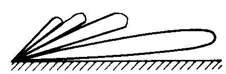
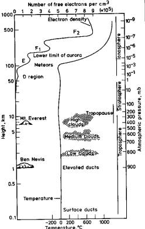
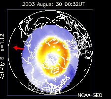
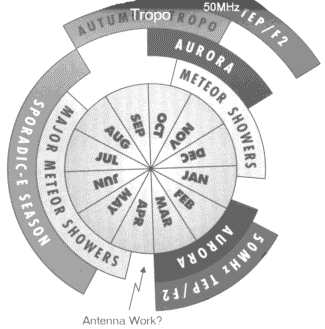

## (an overview only)

By Rick Bandla (VE3CVG)  
As presented at RAC Forum in Carp, ON on August 30, 2003

## Radio Waves

* Electromagnetic Waves composed of equal electric and magnetic power levels
* Travel in straight lines more or less like light
* Change direction if/when encounter atoms, molecules, ions, electrons.
* Wave movement takes place by stimulation of electrons
* Coherent electron activity re-enforces wave

## The Ground - info from OZ1RH

* Low angle of radiation usually desirable
* Vertical antennas need perfect ground to give low angle of radiation
* Radiation angle of a horizontal beam is a function of its height over the ground.
* Quality of ground has minimal effect when using horizontal antennas
* Antenna on a hill (land slopes down) will have a lower angle of radiation than flat land.

| Height above Flat Ground | Ground Gain | Max Radiation @ |
|--------------------------|-------------|-----------------|
| 1/2 wavelength           | -1.7dB      | 13 degrees      |
| 1 wavelength             | +2.6dB      | 11 degrees      |
| 2 wavelengths            | +4.8dB      | 7 degrees       |
| 5 wavelengths            | +5.5dB      | 3 degrees       |

Typical beam pattern above ground. The ground influences the angle of the lobes and in particular the largest (main) lobe.

## Ionization

* Atoms are usually electrically neutral with a +ve nucleus surrounded by some quantity of electrons
* If electrons become separated we have free electrons and positively charged ions
* Ionization occurs as a result of bombardment by charged particles, UV, X-rays, gamma rays
* Radio waves are non-ionizing radiation

## When Radio Waves meet Matter

* Refraction
  * change in direction of wave
  * Refraction due to ionization looks like reflection
* Reflection
  * some fraction of a wave is turned back
* Scattering
  * wave encounters objects smaller than a wavelength.
  * Over-dense scattering resembles refraction and reflection.
  * Under-dense scattering from objects with order, may result in usable propagation (meteors, aurora)
* Absorption
  * energy converted into heat
* Diffraction
  * obstacle removes part of a wave front. Causes propagation into the shadow of the object
  * Loss increases with scattering angle and frequency (clear takeoff more important at higher frequencies)

## Refractive Index or N

* N is the radio wave velocity in free space/velocity in a new medium
* Calculation: N = 77.6  (pressure in millibars/temp in kelvins) + 3.73 (105 (water vapour pressure in millibars/temp2)) which is typically about 324
* N is independent of frequency
* In normal atmosphere, air temp and dew point decrease with height above ground therefore N also decreases

## Troposphere

* This is where our weather lives
* Tropopause is upper boundary and is the temperature inversion layer (about 10 km depending on lat and conditions)
* No significant ionization
* Physical properties of the air may vary radio refractive index or N
* N decreases linearly for first 2-3km (particularly after a rainstorm). Rate of decrease reduces with altitude
* Refraction within the troposphere is what extends the optical horizon to the radio horizon (4/3 earth)

## Tropo Scatter

* Point to point communication on radio horizon is typically 50km max, S9 signal strength Workable distance is d1(km)=4.1( root h1 +  root h2)
* Troposcatter Ts is always possible, independent of frequency 50MHz - 10GHz
* Range up to 800km is realistic
* Troposcatter loss increases with the scatter angle
* Note: there is also Back Scatter and Side Scatter

## Tropo Ducting

* Caused by radio waves reflected and refracted between layers
* Waveguide in the sky, with very little loss
* Often one opening and one exit
* May be multiple ducts through the same area
* Often excellent signal strength. Ranges of 2500km or more
* May last a few minutes or several hours
* Typically 144MHz and above
* Surface Ducting
  * If temp increases with height, we have a temperature inversion.
  * N decreases more sharply at the boundary, bending radio waves downwards and trapping them between earth and boundary
  * Usually occurs over water
  * generally between 15m and 400m deep
* Elevated ducting
  * formed by double discontinuity in N.
  * .5 - 2 km above ground or sea
  * shallow compared to surface ducts

## Atmosphere Chart

## Ionosphere

* MUF or Maximum Usable Frequency is highest freq returned to earth
* D Region at 60-90km
  * Absorbs HF but almost transparent to VHF and above
  * Contributes to VHF and above forward scatter during intense solar activity
* E Region at 90 to 120km
  * Ions predominate neutral atoms
  * Sporadic E, Aurora, Meteors capable of reflecting VHF and above
* F region
  * F1 provides some refraction at 50MHz
  * F2 at about 350km elevation, between 100km and 200km deep
  * World wide communication at 50MHz but insufficient ionization to affect 144MHz and up

## Sporadic E (Es)

* Range 500-8000km on 50MHz (multi hop)
* Range 800 - 4000km on 144MHz (double hop)
* Occasional openings to 222MHz
* Openings last between a few minutes and a few hours
* Higher frequency = shorter openings
* Geographically selective
* A station can work several stations all in one or 2 grid squares
* Signals are often very strong
* Types:
  * Temperate Zone Es - solar driven, summertime, 50-200MHz
  * Auroral Es - see Aurora slide
  * Equatorial Zone Es - 50-100MHz, around the magnetic equator
* Some Temperate Zone predictability/probability:
  * 50MHz Apr-Sept, between 6am and 10pm
  * 144MHz May-Aug, between 11am and 8 pm
  * mid-morning peak & larger peak at about 6pm
  * Tends to occur repeatedly between same spots
* Es layers contain high concentrations of ionized metal, which gradually fall to earth
* Constantly being replaced by meteor debris
* No definite relationship between solar cycle and E layer
* Possible relationship with thunderstorms
* Theory: Wind shear causing ion concentration

## Aurora (Au)

* Complex! Charged particles emanating from sun in the solar wind become trapped in earth's magneto tail which streams behind earth away from sun. Increase in solar flux stretches magneto tail until it snaps and reconnects into a more stable configuration. Some snapped particles eject into space, retained particles collapse back to earth. These collapsing particles somehow pick up enough energy to penetrate the E region.
* Auroral effects are in E layer
* Daily rotation of magnetic pole about geographic pole & solar wind make the auroral zone approach and recede twice daily
* Usable from 50-902MHz but mainly 50MHz and 144MHz
* Visible aurora (400km high) & radio aurora (100km high) not consistent
* Both stations point antenna at aurora
* High power helps
* Range is about 2000km (usually less because of lack of stations)
* Region where auroral contact is possible is referred to as the "boundary fence". Oval 2000km to your east and your west and 1000km to your north (forward scatter) and south (back scatter).

## Auroral Es

* Follows time and location of aurora
* 50-200MHz
* Higher latitudes, night or day, other times besides summer
* Ionization originates from auroral particles
* Usually formed from ionization remaining after auroral storm
* Ion concentration probably due to wind shear
* Usually northern latitudes but can spread south to mid latitudes

## Aurora Map

## Meteor Scatter (MS)

* Propagation is actually from trails of ionization as high velocity fragments (grains) burn up at about 100km.
* Trail (tail) 20 - 65km long 1m in diam
* Meteors are random, any time works, but midnight to dawn best for MS
* Meteor "showers" are very predictable.
  * Quadrantids 3-4 Jan
  * Arietids 8 June
  * Nu Geminids 12 July
  * Perseids 12-13 Aug
  * Geminids 13-14 Dec
* Pings are abrupt and rapidly fades (semi-coherent scatter)
* Bursts are much longer and may come from over or under dense trails
* Bursts from over dense trails increase in strength & oscillate then fade
* MS significantly easier on 50MHz than on 432MHz

## Meteor Scatter - What Works?

* High ERP an advantage, horizontal polarization at both stations
* "Point a not too directional beam along the great circle path at the other station and hope for meteors"
* With meteors at 88-100km high max range is 2100 - 2250km
* Longer contacts probably single hops assisted by other modes
* WSJT software by K1JT makes MS much easier

## Summary of Propagation Modes

| Medium          | Mode                | Abbrev | 6M | 2M | 70cm | Above |
|-----------------|---------------------|--------|----|----|------|-------|
| **Troposphere** | Refraction          | Tropo  | X  | X  | X    | X     |
| -               | Ducting             | Tropo  | -  | X  | X    | X     |
| -               | Scatter             | Ts     | X  | X  | X    | X     |
| **Ionosphere**  | Sporadic E          | Es     | X  | X  | -    | -     |
| -               | Auroral E           | Au Es  | X  | X  | -    | -     |
| -               | Aurora              | Au     | X  | X  | X    | X     |
| -               | F2                  | F2     | X  | -  | -    | -     |
| -               | Meteor Scatter      | MS     | X  | X  | ?    | ?     |
| -               | Ionospheric Scatter | -      | X  | ?  | -    | -     |
| **Obstacles**   | Diffraction         | -      | X  | X  | X    | X     |
| -               | Moon bounce         | EME    | ?  | X  | X    | X     |
| -               | Reflection          | -      | X  | X  | X    | X     |

## Polarization

* Refraction and reflection of a wave is more probable when polarization of the wave and the surface are in the same plane. (less loss)
* Horizon, Ionosphere, clouds, various layers are horizontal with respect to the surface of the earth.
* Horizontal polarization more successful for DX propagation at VHF and above frequencies.

## So What Mode Was That?

* Sometimes it's obvious from frequency or characteristics of the signals
* Sometimes more than one mode contributes to a path
* Short Es and long MS sound the same
* Very short tropo ducts sound same as Es (same time of day, same season)
* Important to know whether a burst of signal is a prelude to an Es opening
* Tools include weather maps, books, beacons, broadcast signals, FM repeater behaviour, DX spots, web sites, sun stats, aurora stats, celestial patterns, discussion and info sharing
* Listen a lot!   Experience!

## What You Need to Succeed on VHF/UHF & Up

* A transceiver that covers the desired bands & has reasonable performance
* Extra power useful but not mandatory
* Good Antennas are mandatory!!!
* Horizontally polarized
* Rotator
* The more gain the better
* Low loss feed lines very desirable
* Clear uncluttered horizon (there are other options)
* Flat or elevated site very desirable
* Antenna height very helpful
* Computer and some software in the shack helpful but not mandatory
* Internet access in the shack can be useful

## When's A Good Time?

## Effective Transmission Modes

* Voice on SSB
  * for all types of propagation
  * best for stronger signals
* CW
  * For all types of propagation
  * Best for weaker signals
* Digital JT44 & JT6M
  * Excellent for Tropo
  * Best for very weak signals
  * Superior to CW
* Digital FSK441
  * Best for any short burst scatter
  * Doppler tolerant
  * Excellent for Meteor Scatter
* Digital PSK31
  * For signals too weak for SSB
  * Slightly better than CW
* Other?

## WSJT by K1JT Joe Taylor

* Windows PC software (freeware) which uses a computer sound card connected to a transceiver for:
* Tropo propagation using JT44 or JT6M
* Meteor Scatter using FSK441
* EME (moon bounce) using modified JT44
* Excellent way to learn about propagation
* See [http://www.physics.princeton.edu/pulsar/K1JT/](http://www.physics.princeton.edu/pulsar/K1JT/)  to download a copy of the software
* See [http://www.chris.org/cgi-bin/jt65talk](http://www.chris.org/cgi-bin/jt65talk) for co-ordinating JT44 contacts.
* See [http://www.pingjockey.net/cgi-bin/pingtalk](http://www.pingjockey.net/cgi-bin/pingtalk) for co-ordinating FSK441 contacts.

## References

* The VHF/UHF DX Book Vol#1 RSGB - Editor Ian White G3SEK
* See the list of web sites

## Web Sites

* Bill Hepburn's VHF UHF Tropo Ducting as well as links to MUF, Aurora, Meteor Scatter,  F2 Skip [http://www.dxinfocentre.com/tropo.html](http://www.dxinfocentre.com/tropo.html)
* Space Weather Now (solar, aurora, etc.) [http://www.swpc.noaa.gov/communities/space-weather-enthusiasts](http://www.swpc.noaa.gov/communities/space-weather-enthusiasts)
* Gary Kronk's Meteor Observing Calendar [http://meteorshowersonline.com/calendar.html](http://meteorshowersonline.com/calendar.html)
* Weather Related Interference [http://web.archive.org/web/20040728101534/http://www.bbc.co.uk/reception/factsheets/docs/reception_weather.pdf](http://web.archive.org/web/20040728101534/http://www.bbc.co.uk/reception/factsheets/docs/reception_weather.pdf)
* VHF UHF and up Spots [http://dxworld.com/](http://dxworld.com/)
* IW9CER Spots and info [https://www.dxfuncluster.com/mapas/maps_it9tyr.htm](https://www.dxfuncluster.com/mapas/maps_it9tyr.htm)
* Paul Kelley N1BUG - VHF and Above [http://www.n1bug.com/](http://www.n1bug.com/)  
* Palle Preben-Hansen (Denmark) OZ1RH [http://www.qsl.net/oz1rh/](http://www.qsl.net/oz1rh/)
* Rick Bandla VE3CVG [https://ve3cvg.webqth.com/](https://ve3cvg.webqth.com/)

## The End
