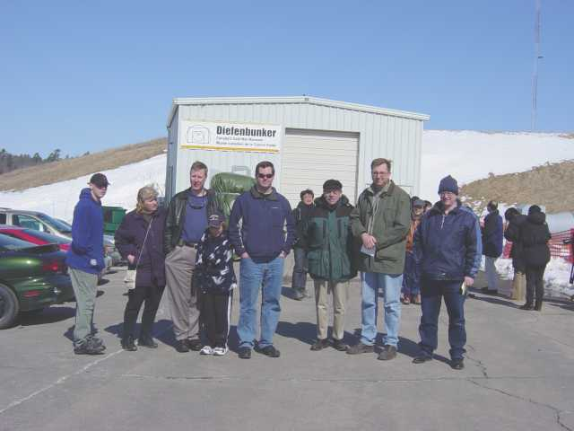

## WCARC June VHF Contest Participation from FN15 (2014-present)

With the departure of Al VO1NO, back to his home province, we not only lost Al's crazy humour and momentum to participate (Field Day fashion) in the ARRL June VHF
Contest but we also lost his equipment resources and vehicles. The club decided to try a different approach for 2014, in order to increase participation and encourage
new operators. Doug Leach (VE3XK) dedicated a huge amount of personal time and championed the efforts to find towers, antennas, feedlines and a location. Others pitched in to organize radio operators, helpers,
food etc. Loans of some superb equipment greatly helped the cause.
Details can be found [by clicking here](june_vhf_contest_2014.html).

## WCARC June VHF Contest Expeditions to FN04 (2008-2013)

From 2008 to 2013, many members of the WCARC embarked on a grid expedition to grid square FN04 near Grafton, Ontario, and set up a Field Day-type intalltion to compete in the annual
ARRL June VHF Contest. Further information can be found in the pages below:

* [Information and pictures from the 2008-2013 grid expeditions](extra.html)
* [An article in the West Carleton Review - July 21, 2011](news/press1.html)

## VO1NO Antenna Party July 2006

Several members of WCARC and some other hams turned out to help Al VO1NO raise his latest addition to his tower collection. A good time was had by all, and
it was also very interesting. Our photographer, Barny VA3BGB was on hand to take pictures:

* [Photos of VO1NO antenna party, July 2006](vo1noantparty/vo1noant.html)

## Field Day - 2006

WCARC hopes to help host a 2A entry in Field Day this year. Al VO1NO/VE3 has graciously agreed to be the Field Day organizer but he needs your help! Visitors
are always welcome at all Field Day sites. WCARC will be teamed up with the Lanark/Perth group. The Field Day site will be somewhere between Kanata and Perth.
WCARC is responsible to set up a VHF station, a SSB HF station and possibly a GOTA station. Again - the club needs your participation and help.

## Field Day Update from Al VO1NA/VE3 April 7, 2006

Hello everyone,

Just a quick update on a fun and exciting activity that promises to be the Ham Radio Highlight of the year!

Field Day will take place on the weekend of 24/25 June 2006.  This will be a joint effort of the Lanark North Leeds ARES Group, and the West Carleton Amateur Radio Club.  We intend to operate in the 2A category, which means that we will have 2 HF stations on the air simultaneously.   We will also have a GOTA (Get On The Air) station, a Satellite station, and a VHF/UHF station.  The site will be the Agricultural Fairground in Middleville,
conveniently located midway between the Amateur populations of the two organizations.  While I have not been able to conduct a reconnaissance yet,
the chairman of the fairground (currently a student on the Basic course that Tony VE3XNT and I are teaching) assures me that we will have access to the
buildings on the site, including the washrooms and kitchen.

For anyone not familiar with Field Day, the objectives are to set up stations using emergency power, make as many QSOs as possible, and have a
whole lot of fun!  It doesn't matter that you are not a contester, not on HF, or not even licensed!  Everyone can participate!

Setup will start at 1400 local Friday (that's 2:00 PM, or, for anyone who may have been in the Air Force, Mickey's small hand will be on the "2" and
his big hand on the "12")!  We then have 24 hours to get all the stations assembled and antennas in the air before the contest starts at 1400
Saturday.  The contest will run for 24 hours, ending at 1400 Sunday.  In order to ease the task of organizing the event, station captains will be
responsible for assembling the various stations and ensuring that they are ready to get on the air.  The station captains are:

* HF CW - Tony VE3XNT
* HF SSB - Dale VE3XZT
* GOTA - Al VE3KAI
* Satellite - Barrie VE3BSB
* VHF/UHF - Al VO1NO

The GOTA station requires some explanation.  It stands for "Get On The Air", and is intended to get new or inexperienced hams on the air.  In fact, you don't even need to be licensed!  As long as the station's operation is supervised by a licensed Amateur, anyone can use it.  This is a great
opportunity to get young people out for Field Day.

We are working out the details for food at Field Day, but we hope to have hot dogs and hamburgers for lunch Saturday, and breakfast Sunday for those who operate overnight.  Saturday's supper will be a pot luck, with BBQs available for anyone needing them.

Over the next few months, I will send out more detailed Field Day updates. In the meantime, make sure that you don't do anything stupid like plan on
getting married on Field Day!  Your spouse will really miss you on future anniversary weekends!

73  
Al Penney  
VO1NO / VE3

## Roving and Grid Hunting

Several members of WCARC participate in ARRL VHF contests each year. A rover is a mobile station, usually set up in a van or truck, using appropriate antennas, power, and equipment. The rover team may include up to 2 operators, including the driver. This team drives around to various grids and offer contacts to whoever can communicate with them. A rover that is equipped for many bands and that covers several grids, can very significantly increase the contest score of the stations that communicate with the rover.

After a successful September 2005 contest (fall roving), and a successful January 2006 contest (winter roving), Tom VA3NFA, has announced that he will be roving in the June 2006 ARRL VHF contest, so we encourage the club members to help Tom get ready. He will be operating in at least FN14, FN24, FN15, FN25.

* [Tom's Powerpoint Presentation on Roving (Nov. 2005)](va3nfa_rover_ppt/OVMRC-ROVER.htm)
* [Tom's Semi-Psycho Rover (2005)](presentations/00_va3nfasemipsycho.html)

For more info about roving see these links.

* [Tom and Dale's Roving Experience to FN14/FN24/FN15/FN25 in 2005](presentations/00_va3nfarover.html)
* [Rick and Jim's Excursion to FN16/FN26 (Aug. 2004)](presentations/00_ve3cvgrover.html)
* [Tom's pictures from the September 2006 VHF contest](http://va3nfa.blogspot.ca/2006_09_01_archive.html)

## Family Activities - Diefenbunker Tour

On Saturday, March 19th, 2005, WCARC families and friends (11) attended a tour of the Diefenbunker, located north of the town of Carp, on Carp Rd. Also talked to the hams at the museum station VE3CWM (Cold War Museum). It was a very interesting experience and if you haven't taken this tour, we suggest that you do so at your next opportunity.

Picture of the tour group from left to right: Brad (VE3BSM) with family, Dean (VA3CDD), Tim (VE3MY), Tom (VA3NFA) and Les (VA3BZQ).
Frank (VE3YY) and kids were not in the picture. Dale (VE3XZT) took the picture.

For more info on the Diefenbunker see [http://www.diefenbunker.ca/](http://www.diefenbunker.ca).
