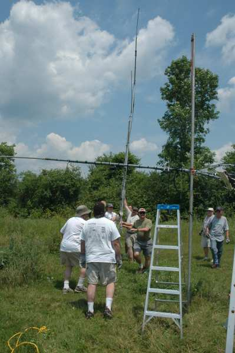
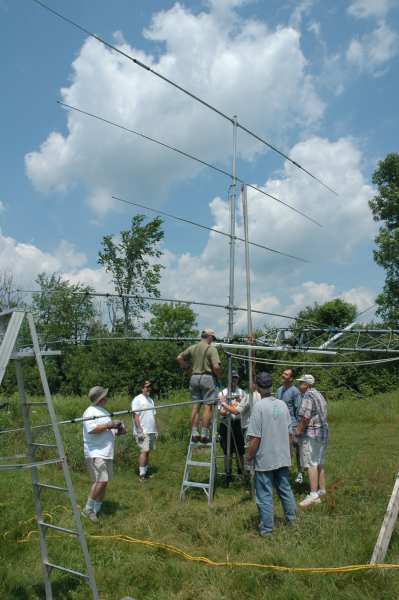
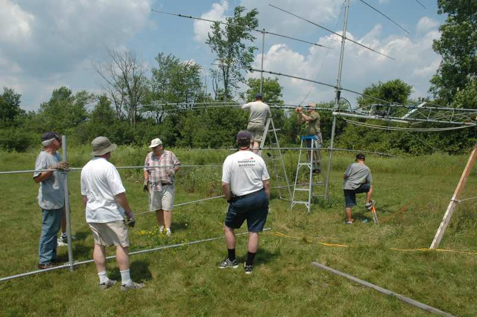
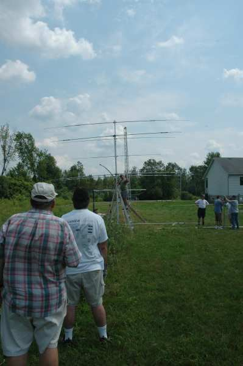
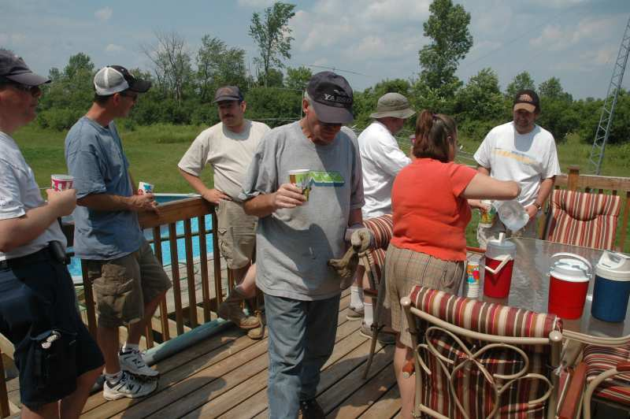
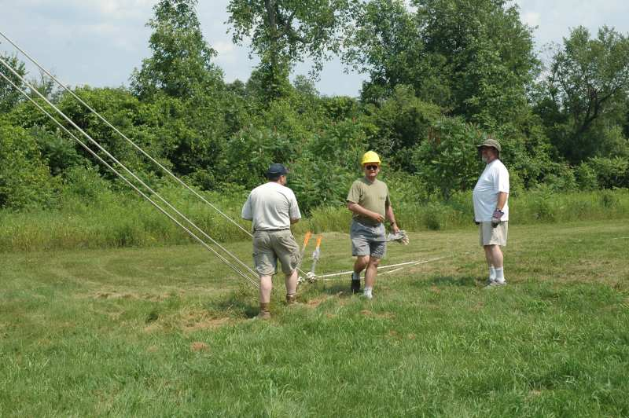
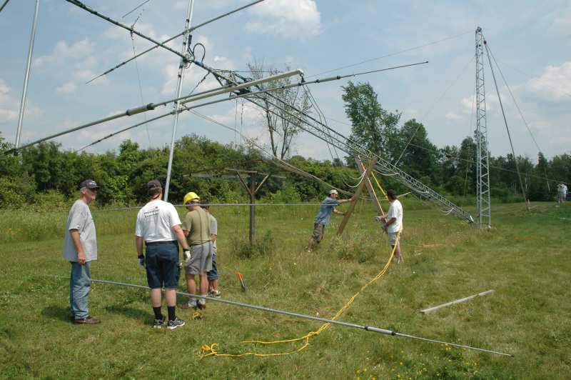
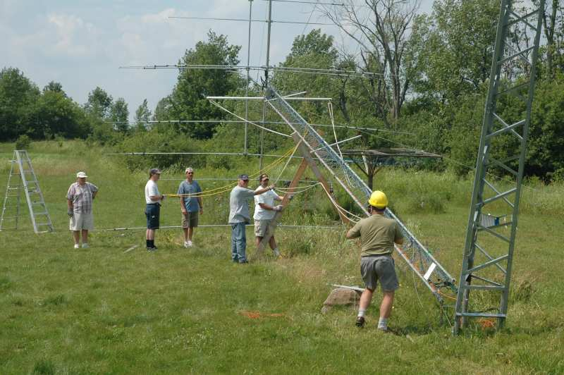
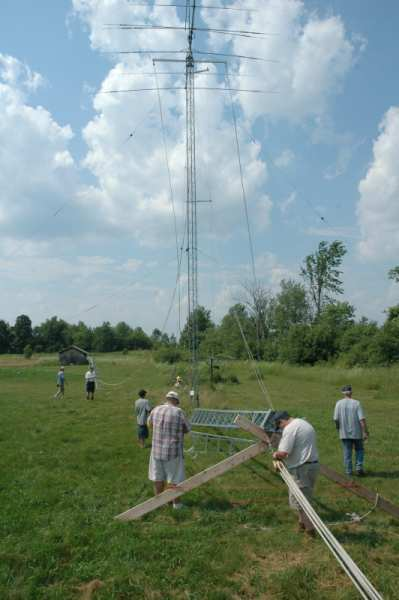
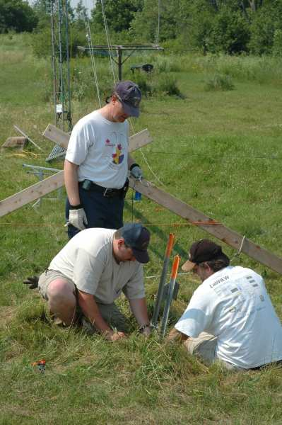

On July 3rd, 2006, Al (VO1NO) had an antenna raising party and had a good turnout of helping hands. Al  gave us a working demonstration of the falling derrick method of raising a tower. Amazing operation to watch. We had a refreshing drink at half time and a BBQ after the hard work was over.

